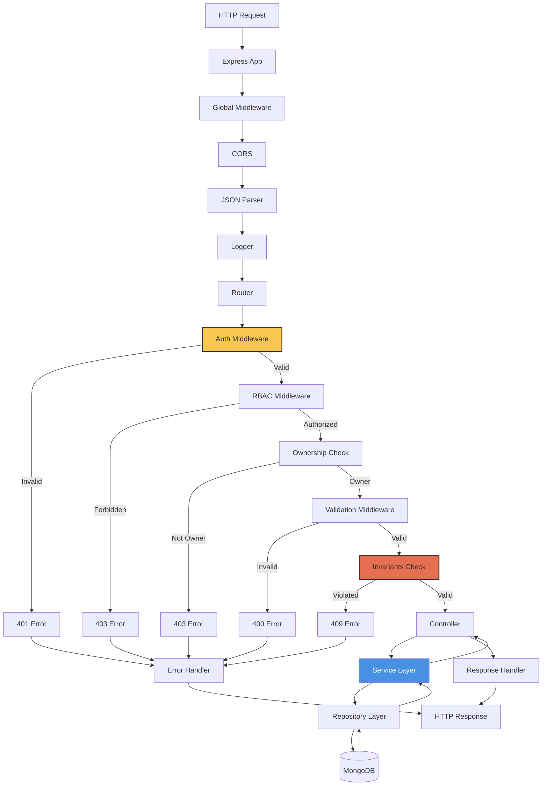
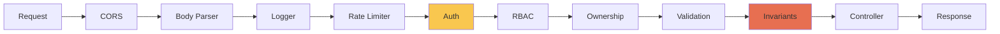

# SahelArt Backend - Architecture

## Vue d'ensemble

Ce document définit l'architecture détaillée du backend SahelArt, construit avec Node.js, Express et TypeScript.

**Version** : 1.0.0
**Date** : 2026-02-06
**Runtime** : Node.js 20.x LTS
**Framework** : Express 4.18+
**Language** : TypeScript 5.3+

---

## 1. Structure du Projet

### 1.1 Organisation des dossiers

```
backend/
├── src/
│   ├── config/                 # Configuration centralisée
│   │   ├── database.ts
│   │   ├── jwt.ts
│   │   └── upload.ts
│   │
│   ├── middleware/             # Middleware Express
│   │   ├── auth.ts            # JWT verification
│   │   ├── rbac.ts            # Role-based access control
│   │   ├── ownership.ts       # Resource ownership check
│   │   ├── invariants.ts      # Business invariants enforcement
│   │   ├── validation.ts      # Request validation
│   │   ├── errorHandler.ts    # Global error handling
│   │   └── logger.ts          # Request logging
│   │
│   ├── routes/                 # Express routes (API endpoints)
│   │   ├── index.ts           # Route aggregator
│   │   ├── auth.routes.ts
│   │   ├── user.routes.ts
│   │   ├── product.routes.ts
│   │   ├── order.routes.ts
│   │   ├── payment.routes.ts
│   │   ├── shipment.routes.ts
│   │   ├── category.routes.ts
│   │   └── admin.routes.ts
│   │
│   ├── controllers/            # Request handlers
│   │   ├── auth.controller.ts
│   │   ├── user.controller.ts
│   │   ├── product.controller.ts
│   │   ├── order.controller.ts
│   │   ├── payment.controller.ts
│   │   ├── shipment.controller.ts
│   │   ├── category.controller.ts
│   │   └── admin.controller.ts
│   │
│   ├── services/               # Business logic
│   │   ├── auth.service.ts
│   │   ├── user.service.ts
│   │   ├── product.service.ts
│   │   ├── order.service.ts
│   │   ├── payment.service.ts
│   │   ├── shipment.service.ts
│   │   ├── category.service.ts
│   │   ├── email.service.ts
│   │   └── storage.service.ts
│   │
│   ├── repositories/           # Data access layer
│   │   ├── user.repository.ts
│   │   ├── product.repository.ts
│   │   ├── order.repository.ts
│   │   ├── payment.repository.ts
│   │   ├── shipment.repository.ts
│   │   ├── category.repository.ts
│   │   └── log.repository.ts
│   │
│   ├── models/                 # Mongoose schemas
│   │   ├── User.ts
│   │   ├── Product.ts
│   │   ├── Order.ts
│   │   ├── Payment.ts
│   │   ├── Shipment.ts
│   │   ├── Category.ts
│   │   └── Log.ts
│   │
│   ├── types/                  # TypeScript types & interfaces
│   │   ├── express.d.ts       # Express extensions
│   │   ├── auth.types.ts
│   │   ├── product.types.ts
│   │   ├── order.types.ts
│   │   └── common.types.ts
│   │
│   ├── utils/                  # Utilities
│   │   ├── asyncHandler.ts    # Async error wrapper
│   │   ├── ApiError.ts        # Custom error class
│   │   ├── ApiResponse.ts     # Standard response format
│   │   └── validators.ts      # Custom validators
│   │
│   ├── app.ts                  # Express app setup
│   └── server.ts               # Server entry point
│
├── uploads/                    # File storage (dev only)
├── tests/                      # Tests
│   ├── unit/
│   ├── integration/
│   └── e2e/
│
├── .env.example
├── .env.development
├── .env.production
├── tsconfig.json
├── package.json
└── README.md
```

---

## 2. Architecture en Couches

### 2.1 Flux de requête détaillé



### 2.2 Responsabilités de chaque couche

**Routes** :
- Définir les endpoints HTTP
- Associer les middleware appropriés
- Passer la requête au controller

**Controllers** :
- Parser et valider les inputs
- Appeler les services appropriés
- Formatter la response
- Gérer les erreurs HTTP

**Services** :
- Implémenter la logique métier
- Orchestrer plusieurs repositories
- Appliquer les règles du domaine
- Gérer les transactions

**Repositories** :
- Encapsuler l'accès aux données
- Exécuter les queries MongoDB
- Gérer les index et optimisations
- Retourner des objets de domaine

**Models** :
- Définir les schémas Mongoose
- Validation des données
- Hooks (pre/post save)
- Méthodes et statics

---

## 3. Middleware Pipeline

### 3.1 Ordre d'exécution



### 3.2 Implémentation des middleware critiques

#### 3.2.1 Auth Middleware (JWT Verification)

```typescript
// src/middleware/auth.ts
import jwt from 'jsonwebtoken';
import { Request, Response, NextFunction } from 'express';
import { ApiError } from '../utils/ApiError';

interface JwtPayload {
  userId: string;
  email: string;
  role: 'customer' | 'vendor' | 'admin';
}

export const verifyToken = async (
  req: Request,
  res: Response,
  next: NextFunction
) => {
  try {
    const token = req.headers.authorization?.replace('Bearer ', '');

    if (!token) {
      throw new ApiError(401, 'No token provided');
    }

    const decoded = jwt.verify(
      token,
      process.env.JWT_SECRET!
    ) as JwtPayload;

    // Attacher user au request
    req.user = {
      id: decoded.userId,
      email: decoded.email,
      role: decoded.role
    };

    next();
  } catch (error) {
    if (error instanceof jwt.JsonWebTokenError) {
      next(new ApiError(401, 'Invalid token'));
    } else if (error instanceof jwt.TokenExpiredError) {
      next(new ApiError(401, 'Token expired'));
    } else {
      next(error);
    }
  }
};
```

#### 3.2.2 RBAC Middleware

```typescript
// src/middleware/rbac.ts
import { Request, Response, NextFunction } from 'express';
import { ApiError } from '../utils/ApiError';

type UserRole = 'customer' | 'vendor' | 'admin';

export const checkRole = (allowedRoles: UserRole[]) => {
  return (req: Request, res: Response, next: NextFunction) => {
    if (!req.user) {
      return next(new ApiError(401, 'Unauthorized'));
    }

    if (!allowedRoles.includes(req.user.role)) {
      return next(new ApiError(403, 'Forbidden: Insufficient permissions'));
    }

    next();
  };
};

// Utilisation dans routes
router.post('/products',
  verifyToken,
  checkRole(['vendor', 'admin']),  // Seulement vendor et admin
  productController.create
);
```

#### 3.2.3 Ownership Middleware

```typescript
// src/middleware/ownership.ts
import { Request, Response, NextFunction } from 'express';
import { ApiError } from '../utils/ApiError';
import { Product } from '../models/Product';
import { Order } from '../models/Order';

type ResourceType = 'product' | 'order' | 'shipment';

export const checkOwnership = (resourceType: ResourceType) => {
  return async (req: Request, res: Response, next: NextFunction) => {
    try {
      // Admin bypass ownership check
      if (req.user.role === 'admin') {
        return next();
      }

      const resourceId = req.params.id;

      switch (resourceType) {
        case 'product':
          const product = await Product.findById(resourceId);
          if (!product) {
            return next(new ApiError(404, 'Product not found'));
          }
          if (product.vendorId.toString() !== req.user.id) {
            return next(new ApiError(403, 'Not the owner of this product'));
          }
          break;

        case 'order':
          const order = await Order.findById(resourceId);
          if (!order) {
            return next(new ApiError(404, 'Order not found'));
          }
          // Customer voit ses commandes, Vendor voit commandes de ses produits
          const isCustomer = order.customerId.toString() === req.user.id;
          const isVendor = req.user.role === 'vendor' &&
                          order.items.some(item => item.vendorId.toString() === req.user.id);

          if (!isCustomer && !isVendor) {
            return next(new ApiError(403, 'Not authorized to view this order'));
          }
          break;

        // ... autres cas
      }

      next();
    } catch (error) {
      next(error);
    }
  };
};
```

#### 3.2.4 Invariants Middleware

```typescript
// src/middleware/invariants.ts
import { Request, Response, NextFunction } from 'express';
import { ApiError } from '../utils/ApiError';
import { Product } from '../models/Product';
import { Order } from '../models/Order';

export const invariants = {
  // INV-1: Stock MUST NOT be negative
  stockAvailable: async (req: Request, res: Response, next: NextFunction) => {
    try {
      const { items } = req.body; // [{productId, quantity}]

      for (const item of items) {
        const product = await Product.findById(item.productId);

        if (!product) {
          throw new ApiError(404, `Product ${item.productId} not found`);
        }

        if (product.stock < item.quantity) {
          throw new ApiError(409,
            `INV-1 violated: Insufficient stock for ${product.name}. ` +
            `Available: ${product.stock}, Requested: ${item.quantity}`
          );
        }
      }

      next();
    } catch (error) {
      next(error);
    }
  },

  // INV-2: Order MUST contain at least 1 product
  orderHasProducts: (req: Request, res: Response, next: NextFunction) => {
    const { items } = req.body;

    if (!items || !Array.isArray(items) || items.length === 0) {
      return next(new ApiError(409, 'INV-2 violated: Order must contain at least one product'));
    }

    next();
  },

  // INV-3: Order total MUST equal sum(price × quantity)
  validOrderTotal: async (req: Request, res: Response, next: NextFunction) => {
    try {
      const { items, total } = req.body;
      let calculatedTotal = 0;

      for (const item of items) {
        const product = await Product.findById(item.productId);
        if (!product) {
          throw new ApiError(404, `Product ${item.productId} not found`);
        }
        calculatedTotal += product.price * item.quantity;
      }

      if (Math.abs(calculatedTotal - total) > 0.01) { // Tolérance float
        throw new ApiError(409,
          `INV-3 violated: Total mismatch. ` +
          `Calculated: ${calculatedTotal}, Provided: ${total}`
        );
      }

      next();
    } catch (error) {
      next(error);
    }
  },

  // INV-6: Order MUST NOT ship before payment confirmed
  orderPaidBeforeShip: async (req: Request, res: Response, next: NextFunction) => {
    try {
      const orderId = req.params.id;
      const order = await Order.findById(orderId);

      if (!order) {
        throw new ApiError(404, 'Order not found');
      }

      if (order.status !== 'Paid') {
        throw new ApiError(409,
          `INV-6 violated: Cannot ship order that is not paid. ` +
          `Current status: ${order.status}`
        );
      }

      next();
    } catch (error) {
      next(error);
    }
  },

  // INV-5: Payment amount MUST equal order total
  paymentAmountMatchesOrder: async (req: Request, res: Response, next: NextFunction) => {
    try {
      const { orderId, amount } = req.body;
      const order = await Order.findById(orderId);

      if (!order) {
        throw new ApiError(404, 'Order not found');
      }

      if (Math.abs(order.total - amount) > 0.01) {
        throw new ApiError(409,
          `INV-5 violated: Payment amount does not match order total. ` +
          `Order: ${order.total}, Payment: ${amount}`
        );
      }

      next();
    } catch (error) {
      next(error);
    }
  }
};
```

---

## 4. Modèles de Données (Mongoose)

### 4.1 User Model

```typescript
// src/models/User.ts
import mongoose, { Schema, Document } from 'mongoose';
import bcrypt from 'bcryptjs';

export interface IUser extends Document {
  email: string;
  password: string;
  role: 'customer' | 'vendor' | 'admin';
  profile: {
    firstName: string;
    lastName: string;
    phone?: string;
    address?: string;
  };
  status: 'active' | 'suspended';
  createdAt: Date;
  updatedAt: Date;

  // Methods
  comparePassword(candidatePassword: string): Promise<boolean>;
}

const UserSchema = new Schema<IUser>({
  email: {
    type: String,
    required: true,
    unique: true,
    lowercase: true,
    trim: true,
    validate: {
      validator: (v: string) => /^[^\s@]+@[^\s@]+\.[^\s@]+$/.test(v),
      message: 'Invalid email format'
    }
  },
  password: {
    type: String,
    required: true,
    minlength: 8,
    select: false // Ne pas retourner par défaut
  },
  role: {
    type: String,
    enum: ['customer', 'vendor', 'admin'],
    default: 'customer',
    required: true
  },
  profile: {
    firstName: { type: String, required: true },
    lastName: { type: String, required: true },
    phone: String,
    address: String
  },
  status: {
    type: String,
    enum: ['active', 'suspended'],
    default: 'active'
  }
}, {
  timestamps: true
});

// Index
UserSchema.index({ email: 1 }, { unique: true });
UserSchema.index({ role: 1 });
UserSchema.index({ status: 1 });

// Hash password avant sauvegarde
UserSchema.pre('save', async function(next) {
  if (!this.isModified('password')) return next();

  const salt = await bcrypt.genSalt(10);
  this.password = await bcrypt.hash(this.password, salt);
  next();
});

// Méthode pour comparer password
UserSchema.methods.comparePassword = async function(
  candidatePassword: string
): Promise<boolean> {
  return bcrypt.compare(candidatePassword, this.password);
};

export const User = mongoose.model<IUser>('User', UserSchema);
```

### 4.2 Product Model

```typescript
// src/models/Product.ts
import mongoose, { Schema, Document, Types } from 'mongoose';

export interface IProduct extends Document {
  vendorId: Types.ObjectId;
  categoryId: Types.ObjectId;
  name: string;
  description: string;
  price: number;
  stock: number;
  images: string[];
  status: 'active' | 'inactive';
  createdAt: Date;
  updatedAt: Date;
}

const ProductSchema = new Schema<IProduct>({
  vendorId: {
    type: Schema.Types.ObjectId,
    ref: 'User',
    required: true,
    index: true
  },
  categoryId: {
    type: Schema.Types.ObjectId,
    ref: 'Category',
    required: true,
    index: true
  },
  name: {
    type: String,
    required: true,
    trim: true,
    minlength: 3,
    maxlength: 200
  },
  description: {
    type: String,
    required: true,
    minlength: 10,
    maxlength: 2000
  },
  price: {
    type: Number,
    required: true,
    min: 0,
    validate: {
      validator: (v: number) => v > 0,
      message: 'Price must be greater than 0'
    }
  },
  stock: {
    type: Number,
    required: true,
    min: 0,
    default: 0,
    validate: {
      validator: Number.isInteger,
      message: 'Stock must be an integer'
    }
  },
  images: {
    type: [String],
    default: [],
    validate: {
      validator: (v: string[]) => v.length <= 5,
      message: 'Maximum 5 images allowed'
    }
  },
  status: {
    type: String,
    enum: ['active', 'inactive'],
    default: 'active'
  }
}, {
  timestamps: true
});

// Index
ProductSchema.index({ vendorId: 1, status: 1 });
ProductSchema.index({ categoryId: 1, status: 1 });
ProductSchema.index({ name: 'text', description: 'text' }); // Full-text search
ProductSchema.index({ price: 1 });
ProductSchema.index({ createdAt: -1 });

// Validation : Stock ne peut pas être négatif (INV-1)
ProductSchema.pre('save', function(next) {
  if (this.stock < 0) {
    return next(new Error('INV-1 violated: Stock cannot be negative'));
  }
  next();
});

ProductSchema.pre('findOneAndUpdate', function(next) {
  const update = this.getUpdate() as any;
  if (update.stock !== undefined && update.stock < 0) {
    return next(new Error('INV-1 violated: Stock cannot be negative'));
  }
  next();
});

export const Product = mongoose.model<IProduct>('Product', ProductSchema);
```

### 4.3 Order Model

```typescript
// src/models/Order.ts
import mongoose, { Schema, Document, Types } from 'mongoose';

export interface IOrderItem {
  productId: Types.ObjectId;
  vendorId: Types.ObjectId;
  name: string;
  price: number;
  quantity: number;
  subtotal: number;
}

export interface IOrder extends Document {
  customerId: Types.ObjectId;
  items: IOrderItem[];
  total: number;
  status: 'Pending' | 'Paid' | 'Shipped' | 'Delivered' | 'Cancelled';
  shippingAddress: {
    street: string;
    city: string;
    postalCode?: string;
    country: string;
    phone: string;
  };
  createdAt: Date;
  updatedAt: Date;
}

const OrderItemSchema = new Schema<IOrderItem>({
  productId: {
    type: Schema.Types.ObjectId,
    ref: 'Product',
    required: true
  },
  vendorId: {
    type: Schema.Types.ObjectId,
    ref: 'User',
    required: true
  },
  name: { type: String, required: true },
  price: { type: Number, required: true, min: 0 },
  quantity: { type: Number, required: true, min: 1 },
  subtotal: { type: Number, required: true, min: 0 }
}, { _id: false });

const OrderSchema = new Schema<IOrder>({
  customerId: {
    type: Schema.Types.ObjectId,
    ref: 'User',
    required: true,
    index: true
  },
  items: {
    type: [OrderItemSchema],
    required: true,
    validate: {
      validator: (v: IOrderItem[]) => v.length > 0,
      message: 'INV-2 violated: Order must contain at least one product'
    }
  },
  total: {
    type: Number,
    required: true,
    min: 0
  },
  status: {
    type: String,
    enum: ['Pending', 'Paid', 'Shipped', 'Delivered', 'Cancelled'],
    default: 'Pending',
    required: true
  },
  shippingAddress: {
    street: { type: String, required: true },
    city: { type: String, required: true },
    postalCode: String,
    country: { type: String, required: true, default: 'Burkina Faso' },
    phone: { type: String, required: true }
  }
}, {
  timestamps: true
});

// Index
OrderSchema.index({ customerId: 1, status: 1 });
OrderSchema.index({ 'items.vendorId': 1, status: 1 });
OrderSchema.index({ 'items.productId': 1 });
OrderSchema.index({ createdAt: -1 });
OrderSchema.index({ status: 1, createdAt: -1 });

// Validation : Total = sum(subtotals) (INV-3)
OrderSchema.pre('save', function(next) {
  const calculatedTotal = this.items.reduce((sum, item) => sum + item.subtotal, 0);

  if (Math.abs(this.total - calculatedTotal) > 0.01) {
    return next(new Error('INV-3 violated: Order total does not match sum of items'));
  }

  next();
});

export const Order = mongoose.model<IOrder>('Order', OrderSchema);
```

### 4.4 Payment Model

```typescript
// src/models/Payment.ts
import mongoose, { Schema, Document, Types } from 'mongoose';

export interface IPayment extends Document {
  orderId: Types.ObjectId;
  customerId: Types.ObjectId;
  amount: number;
  method: 'orange_money' | 'wave' | 'moov' | 'cash';
  status: 'Pending' | 'Completed' | 'Failed';
  transactionId?: string;
  providerReference?: string;
  metadata?: Record<string, any>;
  createdAt: Date;
  updatedAt: Date;
}

const PaymentSchema = new Schema<IPayment>({
  orderId: {
    type: Schema.Types.ObjectId,
    ref: 'Order',
    required: true,
    index: true
  },
  customerId: {
    type: Schema.Types.ObjectId,
    ref: 'User',
    required: true,
    index: true
  },
  amount: {
    type: Number,
    required: true,
    min: 0
  },
  method: {
    type: String,
    enum: ['orange_money', 'wave', 'moov', 'cash'],
    required: true
  },
  status: {
    type: String,
    enum: ['Pending', 'Completed', 'Failed'],
    default: 'Pending',
    required: true
  },
  transactionId: {
    type: String,
    unique: true,
    sparse: true
  },
  providerReference: String,
  metadata: {
    type: Schema.Types.Mixed,
    default: {}
  }
}, {
  timestamps: true
});

// Index
PaymentSchema.index({ orderId: 1, status: 1 });
PaymentSchema.index({ customerId: 1, createdAt: -1 });
PaymentSchema.index({ status: 1 });
PaymentSchema.index({ transactionId: 1 }, { unique: true, sparse: true });

export const Payment = mongoose.model<IPayment>('Payment', PaymentSchema);
```

---

## 5. Services (Business Logic)

### 5.1 Order Service

```typescript
// src/services/order.service.ts
import mongoose from 'mongoose';
import { Order, IOrder, IOrderItem } from '../models/Order';
import { Product } from '../models/Product';
import { Payment } from '../models/Payment';
import { ApiError } from '../utils/ApiError';
import { LogRepository } from '../repositories/log.repository';

interface CreateOrderDTO {
  customerId: string;
  items: Array<{
    productId: string;
    quantity: number;
  }>;
  shippingAddress: {
    street: string;
    city: string;
    postalCode?: string;
    country: string;
    phone: string;
  };
}

export class OrderService {
  /**
   * Créer une commande avec transaction atomique
   * INV-1, INV-2, INV-3, INV-4 enforced
   */
  static async createOrder(data: CreateOrderDTO): Promise<IOrder> {
    const session = await mongoose.startSession();
    session.startTransaction();

    try {
      // 1. Validation et préparation des items
      const orderItems: IOrderItem[] = [];
      let total = 0;

      for (const item of data.items) {
        const product = await Product.findById(item.productId).session(session);

        if (!product) {
          throw new ApiError(404, `Product ${item.productId} not found`);
        }

        if (product.status !== 'active') {
          throw new ApiError(400, `Product ${product.name} is not available`);
        }

        // INV-1: Vérifier stock
        if (product.stock < item.quantity) {
          throw new ApiError(409,
            `INV-1 violated: Insufficient stock for ${product.name}. ` +
            `Available: ${product.stock}, Requested: ${item.quantity}`
          );
        }

        const subtotal = product.price * item.quantity;
        total += subtotal;

        orderItems.push({
          productId: product._id,
          vendorId: product.vendorId,
          name: product.name,
          price: product.price,
          quantity: item.quantity,
          subtotal
        });

        // INV-4: Réserver stock atomiquement
        await Product.findByIdAndUpdate(
          product._id,
          { $inc: { stock: -item.quantity } },
          { session }
        );
      }

      // INV-2: Vérifier qu'il y a au moins 1 produit (validé par schema aussi)
      if (orderItems.length === 0) {
        throw new ApiError(409, 'INV-2 violated: Order must contain at least one product');
      }

      // 2. Créer la commande
      const [order] = await Order.create([{
        customerId: data.customerId,
        items: orderItems,
        total,
        status: 'Pending',
        shippingAddress: data.shippingAddress
      }], { session });

      // 3. Créer le paiement en attente
      await Payment.create([{
        orderId: order._id,
        customerId: data.customerId,
        amount: total,
        method: 'orange_money', // Default, sera mis à jour
        status: 'Pending'
      }], { session });

      // 4. Logger l'action
      await LogRepository.log({
        userId: data.customerId,
        action: 'order.created',
        resource: { type: 'order', id: order._id.toString() },
        metadata: { total, itemsCount: orderItems.length }
      }, session);

      await session.commitTransaction();

      return order;

    } catch (error) {
      await session.abortTransaction();
      throw error;
    } finally {
      session.endSession();
    }
  }

  /**
   * Confirmer paiement et mettre à jour commande
   * INV-5, INV-12 (idempotence) enforced
   */
  static async confirmPayment(
    orderId: string,
    paymentData: {
      transactionId: string;
      providerReference: string;
      amount: number;
    }
  ): Promise<IOrder> {
    const session = await mongoose.startSession();
    session.startTransaction();

    try {
      const order = await Order.findById(orderId).session(session);

      if (!order) {
        throw new ApiError(404, 'Order not found');
      }

      // INV-12: Idempotence - si déjà payé, ignorer
      if (order.status === 'Paid') {
        await session.abortTransaction();
        return order;
      }

      // INV-5: Vérifier montant
      if (Math.abs(order.total - paymentData.amount) > 0.01) {
        throw new ApiError(409,
          `INV-5 violated: Payment amount mismatch. ` +
          `Expected: ${order.total}, Received: ${paymentData.amount}`
        );
      }

      // Mettre à jour le paiement
      await Payment.findOneAndUpdate(
        { orderId: order._id },
        {
          status: 'Completed',
          transactionId: paymentData.transactionId,
          providerReference: paymentData.providerReference
        },
        { session }
      );

      // Mettre à jour la commande
      order.status = 'Paid';
      await order.save({ session });

      // Logger
      await LogRepository.log({
        userId: order.customerId.toString(),
        action: 'payment.confirmed',
        resource: { type: 'order', id: order._id.toString() },
        metadata: { amount: paymentData.amount, transactionId: paymentData.transactionId }
      }, session);

      await session.commitTransaction();

      return order;

    } catch (error) {
      await session.abortTransaction();
      throw error;
    } finally {
      session.endSession();
    }
  }

  /**
   * Marquer commande comme expédiée
   * INV-6 enforced
   */
  static async markAsShipped(
    orderId: string,
    vendorId: string,
    trackingNumber?: string
  ): Promise<IOrder> {
    const order = await Order.findById(orderId);

    if (!order) {
      throw new ApiError(404, 'Order not found');
    }

    // INV-6: Vérifier que la commande est payée
    if (order.status !== 'Paid') {
      throw new ApiError(409,
        `INV-6 violated: Cannot ship unpaid order. Current status: ${order.status}`
      );
    }

    // INV-8: Vérifier que le vendor possède au moins un produit de la commande
    const hasProduct = order.items.some(
      item => item.vendorId.toString() === vendorId
    );

    if (!hasProduct) {
      throw new ApiError(403, 'Not authorized to ship this order');
    }

    order.status = 'Shipped';
    await order.save();

    // Logger
    await LogRepository.log({
      userId: vendorId,
      action: 'order.shipped',
      resource: { type: 'order', id: order._id.toString() },
      metadata: { trackingNumber }
    });

    return order;
  }
}
```

---

## 6. Routes & API Endpoints

### 6.1 Structure des routes

```typescript
// src/routes/index.ts
import { Router } from 'express';
import authRoutes from './auth.routes';
import userRoutes from './user.routes';
import productRoutes from './product.routes';
import orderRoutes from './order.routes';
import paymentRoutes from './payment.routes';
import categoryRoutes from './category.routes';
import adminRoutes from './admin.routes';

const router = Router();

router.use('/auth', authRoutes);
router.use('/users', userRoutes);
router.use('/products', productRoutes);
router.use('/orders', orderRoutes);
router.use('/payments', paymentRoutes);
router.use('/categories', categoryRoutes);
router.use('/admin', adminRoutes);

export default router;
```

### 6.2 Product Routes (Exemple complet)

```typescript
// src/routes/product.routes.ts
import { Router } from 'express';
import { ProductController } from '../controllers/product.controller';
import { verifyToken } from '../middleware/auth';
import { checkRole } from '../middleware/rbac';
import { checkOwnership } from '../middleware/ownership';
import { validate } from '../middleware/validation';
import { invariants } from '../middleware/invariants';
import { productSchemas } from '../validators/product.validators';

const router = Router();

// Public routes
router.get('/',
  ProductController.getAll
);

router.get('/:id',
  ProductController.getById
);

router.get('/search',
  ProductController.search
);

// Protected routes - Vendor only
router.post('/',
  verifyToken,
  checkRole(['vendor', 'admin']),
  validate(productSchemas.create),
  ProductController.create
);

router.patch('/:id',
  verifyToken,
  checkRole(['vendor', 'admin']),
  checkOwnership('product'),
  validate(productSchemas.update),
  ProductController.update
);

router.delete('/:id',
  verifyToken,
  checkRole(['vendor', 'admin']),
  checkOwnership('product'),
  invariants.noActiveOrders,
  ProductController.delete
);

// Upload images
router.post('/:id/images',
  verifyToken,
  checkRole(['vendor', 'admin']),
  checkOwnership('product'),
  ProductController.uploadImages
);

export default router;
```

### 6.3 Order Routes

```typescript
// src/routes/order.routes.ts
import { Router } from 'express';
import { OrderController } from '../controllers/order.controller';
import { verifyToken } from '../middleware/auth';
import { checkRole } from '../middleware/rbac';
import { checkOwnership } from '../middleware/ownership';
import { validate } from '../middleware/validation';
import { invariants } from '../middleware/invariants';
import { orderSchemas } from '../validators/order.validators';

const router = Router();

// Customer creates order
router.post('/',
  verifyToken,
  checkRole(['customer']),
  validate(orderSchemas.create),
  invariants.stockAvailable,
  invariants.orderHasProducts,
  invariants.validOrderTotal,
  OrderController.create
);

// Get user's orders
router.get('/my-orders',
  verifyToken,
  OrderController.getMyOrders
);

// Get vendor's orders
router.get('/vendor-orders',
  verifyToken,
  checkRole(['vendor']),
  OrderController.getVendorOrders
);

// Get order details
router.get('/:id',
  verifyToken,
  checkOwnership('order'),
  OrderController.getById
);

// Vendor marks order as shipped
router.patch('/:id/ship',
  verifyToken,
  checkRole(['vendor']),
  invariants.orderPaidBeforeShip,
  OrderController.markAsShipped
);

// Customer confirms delivery
router.patch('/:id/delivered',
  verifyToken,
  checkRole(['customer']),
  checkOwnership('order'),
  OrderController.markAsDelivered
);

// Cancel order
router.patch('/:id/cancel',
  verifyToken,
  checkOwnership('order'),
  OrderController.cancel
);

export default router;
```

---

## 7. Error Handling

### 7.1 Custom Error Class

```typescript
// src/utils/ApiError.ts
export class ApiError extends Error {
  statusCode: number;
  isOperational: boolean;

  constructor(statusCode: number, message: string, isOperational = true) {
    super(message);
    this.statusCode = statusCode;
    this.isOperational = isOperational;

    Error.captureStackTrace(this, this.constructor);
  }
}
```

### 7.2 Global Error Handler

```typescript
// src/middleware/errorHandler.ts
import { Request, Response, NextFunction } from 'express';
import { ApiError } from '../utils/ApiError';
import { LogRepository } from '../repositories/log.repository';

export const errorHandler = (
  err: Error | ApiError,
  req: Request,
  res: Response,
  next: NextFunction
) => {
  let statusCode = 500;
  let message = 'Internal Server Error';

  if (err instanceof ApiError) {
    statusCode = err.statusCode;
    message = err.message;
  }

  // Log errors
  if (statusCode >= 500) {
    console.error('ERROR:', err);
    LogRepository.log({
      level: 'error',
      action: 'error.internal',
      resource: { type: 'system', id: 'error' },
      metadata: {
        message: err.message,
        stack: err.stack,
        path: req.path
      }
    });
  }

  res.status(statusCode).json({
    success: false,
    error: {
      message,
      ...(process.env.NODE_ENV === 'development' && { stack: err.stack })
    }
  });
};
```

---

## 8. Configuration & Environment

### 8.1 Environment Variables

```bash
# .env.example

# Server
NODE_ENV=development
PORT=3000

# Database
MONGODB_URI=mongodb://localhost:27017/sahelart
MONGODB_URI_TEST=mongodb://localhost:27017/sahelart_test

# JWT
JWT_SECRET=your-super-secret-jwt-key-change-in-production
JWT_EXPIRES_IN=24h

# File Upload
UPLOAD_DIR=./uploads
MAX_FILE_SIZE=5242880  # 5MB

# Email
SMTP_HOST=smtp.gmail.com
SMTP_PORT=587
SMTP_USER=your-email@gmail.com
SMTP_PASS=your-app-password
SMTP_FROM=SahelArt <noreply@sahelart.bf>

# Payment Providers (Phase 2)
ORANGE_MONEY_API_KEY=
WAVE_API_KEY=
MOOV_API_KEY=

# CORS
CORS_ORIGIN=http://localhost:5173

# Rate Limiting
RATE_LIMIT_WINDOW_MS=900000  # 15 minutes
RATE_LIMIT_MAX_REQUESTS=100
```

### 8.2 Configuration Files

```typescript
// src/config/database.ts
import mongoose from 'mongoose';

export const connectDB = async (): Promise<void> => {
  try {
    const uri = process.env.MONGODB_URI || 'mongodb://localhost:27017/sahelart';

    await mongoose.connect(uri);

    console.log('MongoDB connected successfully');
  } catch (error) {
    console.error('MongoDB connection error:', error);
    process.exit(1);
  }
};

// Graceful shutdown
process.on('SIGINT', async () => {
  await mongoose.connection.close();
  console.log('MongoDB connection closed');
  process.exit(0);
});
```

```typescript
// src/config/jwt.ts
export const jwtConfig = {
  secret: process.env.JWT_SECRET || 'dev-secret-change-me',
  expiresIn: process.env.JWT_EXPIRES_IN || '24h'
};
```

---

## 9. Testing Strategy

### 9.1 Structure des tests

```
tests/
├── unit/
│   ├── services/
│   │   ├── order.service.test.ts
│   │   └── product.service.test.ts
│   ├── middleware/
│   │   ├── auth.test.ts
│   │   └── invariants.test.ts
│   └── utils/
│       └── validators.test.ts
│
├── integration/
│   ├── api/
│   │   ├── products.api.test.ts
│   │   ├── orders.api.test.ts
│   │   └── auth.api.test.ts
│   └── database/
│       └── repositories.test.ts
│
└── e2e/
    ├── order-flow.e2e.test.ts
    └── payment-flow.e2e.test.ts
```

### 9.2 Exemple de test d'invariant

```typescript
// tests/unit/middleware/invariants.test.ts
import { Request, Response } from 'express';
import { invariants } from '../../../src/middleware/invariants';
import { Product } from '../../../src/models/Product';

describe('Invariants Middleware', () => {
  describe('stockAvailable', () => {
    it('should pass when stock is sufficient', async () => {
      const mockProduct = {
        _id: '123',
        name: 'Test Product',
        stock: 10
      };

      jest.spyOn(Product, 'findById').mockResolvedValue(mockProduct as any);

      const req = {
        body: {
          items: [{ productId: '123', quantity: 5 }]
        }
      } as Request;

      const res = {} as Response;
      const next = jest.fn();

      await invariants.stockAvailable(req, res, next);

      expect(next).toHaveBeenCalledWith(); // No error
    });

    it('should throw 409 when stock is insufficient (INV-1)', async () => {
      const mockProduct = {
        _id: '123',
        name: 'Test Product',
        stock: 3
      };

      jest.spyOn(Product, 'findById').mockResolvedValue(mockProduct as any);

      const req = {
        body: {
          items: [{ productId: '123', quantity: 5 }]
        }
      } as Request;

      const res = {} as Response;
      const next = jest.fn();

      await invariants.stockAvailable(req, res, next);

      expect(next).toHaveBeenCalledWith(
        expect.objectContaining({
          statusCode: 409,
          message: expect.stringContaining('INV-1 violated')
        })
      );
    });
  });
});
```

---

## 10. Performance Optimizations

### 10.1 Database Queries Optimization

```typescript
// Mauvais : N+1 queries
const orders = await Order.find({ customerId });
for (const order of orders) {
  const product = await Product.findById(order.items[0].productId);
  // ...
}

// Bon : Populate + lean
const orders = await Order
  .find({ customerId })
  .populate('items.productId', 'name price images')
  .lean()
  .exec();
```

### 10.2 Pagination Helper

```typescript
// src/utils/pagination.ts
export interface PaginationParams {
  page?: number;
  limit?: number;
}

export interface PaginatedResult<T> {
  data: T[];
  pagination: {
    page: number;
    limit: number;
    total: number;
    pages: number;
    hasNext: boolean;
    hasPrev: boolean;
  };
}

export async function paginate<T>(
  model: any,
  filter: object,
  params: PaginationParams
): Promise<PaginatedResult<T>> {
  const page = Math.max(1, params.page || 1);
  const limit = Math.min(100, Math.max(1, params.limit || 20));
  const skip = (page - 1) * limit;

  const [data, total] = await Promise.all([
    model.find(filter).skip(skip).limit(limit).lean(),
    model.countDocuments(filter)
  ]);

  const pages = Math.ceil(total / limit);

  return {
    data,
    pagination: {
      page,
      limit,
      total,
      pages,
      hasNext: page < pages,
      hasPrev: page > 1
    }
  };
}
```

---

## 11. Security Best Practices

### 11.1 Rate Limiting

```typescript
// src/middleware/rateLimiter.ts
import rateLimit from 'express-rate-limit';

export const apiLimiter = rateLimit({
  windowMs: 15 * 60 * 1000, // 15 minutes
  max: 100,
  message: 'Too many requests from this IP, please try again later',
  standardHeaders: true,
  legacyHeaders: false
});

export const authLimiter = rateLimit({
  windowMs: 15 * 60 * 1000,
  max: 5,
  message: 'Too many login attempts, please try again later',
  skipSuccessfulRequests: true
});
```

### 11.2 Helmet & CORS

```typescript
// src/app.ts
import helmet from 'helmet';
import cors from 'cors';

app.use(helmet());
app.use(cors({
  origin: process.env.CORS_ORIGIN || 'http://localhost:5173',
  credentials: true
}));
```

### 11.3 Input Sanitization

```typescript
import mongoSanitize from 'express-mongo-sanitize';
import { sanitize } from 'express-validator';

app.use(mongoSanitize()); // Prevent NoSQL injection

// Dans validators
export const sanitizeString = (field: string) =>
  sanitize(field).trim().escape();
```

---

## 12. Deployment

### 12.1 PM2 Configuration

```javascript
// ecosystem.config.js
module.exports = {
  apps: [{
    name: 'sahelart-api',
    script: './dist/server.js',
    instances: 2,
    exec_mode: 'cluster',
    env: {
      NODE_ENV: 'development',
      PORT: 3000
    },
    env_production: {
      NODE_ENV: 'production',
      PORT: 3000
    },
    error_file: './logs/err.log',
    out_file: './logs/out.log',
    log_date_format: 'YYYY-MM-DD HH:mm:ss Z',
    merge_logs: true
  }]
};
```

### 12.2 Docker Support

```dockerfile
# Dockerfile
FROM node:20-alpine

WORKDIR /app

COPY package*.json ./
RUN npm ci --only=production

COPY . .
RUN npm run build

EXPOSE 3000

CMD ["npm", "start"]
```

```yaml
# docker-compose.yml
version: '3.8'

services:
  api:
    build: .
    ports:
      - "3000:3000"
    environment:
      - NODE_ENV=production
      - MONGODB_URI=mongodb://mongo:27017/sahelart
    depends_on:
      - mongo
    volumes:
      - ./uploads:/app/uploads

  mongo:
    image: mongo:7
    ports:
      - "27017:27017"
    volumes:
      - mongo-data:/data/db

volumes:
  mongo-data:
```

---

## 13. Conclusion

Cette architecture backend est conçue pour :

1. **Enforcement strict des invariants** : Aucune mutation sans validation
2. **Séparation des responsabilités** : Layers clairs et testables
3. **Sécurité par défaut** : Auth, RBAC, ownership systématiques
4. **Transactions atomiques** : Cohérence des données garantie
5. **Scalabilité** : Stateless, horizontal scaling ready

**Principe directeur** :
> "Enforce the contract at the architectural level, not in scattered business logic."

---

**Document Version** : 1.0.0
**Dernière mise à jour** : 2026-02-06
