# SahelArt - Architecture Système

## Vue d'ensemble

Ce document définit l'architecture système complète de SahelArt, une marketplace multi-vendeurs pour artisans du Sahel.

**Version** : 1.0.0
**Date** : 2026-02-06
**Stack** : Flutter (Web + Mobile) + Node.js/Express + MongoDB

---

## 1. Architecture Système Globale

### 1.1 Vue d'ensemble du système

```mermaid
graph TB
    subgraph Clients["Clients (Internet)"]
        C1[Customer - Mobile]
        C2[Customer - Web]
        V1[Vendor - Mobile]
        V2[Vendor - Web]
        A1[Admin - Web]
    end

    subgraph Frontend["Frontend Layer"]
        FA[Flutter Application]
        FW[Flutter Web Build]
        FM[Flutter Mobile APK/IPA]
    end

    subgraph Backend["Backend Layer"]
        API[Express REST API<br/>Node.js + TypeScript<br/>Port 3000]
        MW[Middleware Pipeline<br/>Auth | RBAC | Invariants]
        BL[Business Logic Layer<br/>Services + Controllers]
    end

    subgraph Data["Data Layer"]
        DB[(MongoDB<br/>Port 27017)]
        FS[File Storage<br/>/uploads/]
    end

    subgraph External["Services Externes"]
        PSP[Payment Providers<br/>Orange Money, Wave]
        EMAIL[Email Service<br/>SMTP]
    end

    C1 & C2 --> FW
    V1 & V2 --> FW
    A1 --> FW
    C1 & V1 --> FM

    FW & FM --> API
    API --> MW
    MW --> BL
    BL --> DB
    BL --> FS
    BL --> PSP
    BL --> EMAIL

    style API fill:#4a90e2,color:#fff
    style DB fill:#47a547,color:#fff
    style MW fill:#f9c74f,stroke:#333,stroke-width:2px
```

### 1.2 Flux de communication

**Protocole** : REST API over HTTPS
**Format** : JSON
**Authentification** : JWT Bearer Token
**Ports** :
- Frontend Dev : 5173 (Flutter web dev)
- Backend : 3000
- MongoDB : 27017

---

## 2. Architecture en Couches

### 2.1 Layered Architecture Pattern


**Principe de séparation** :
- Chaque couche a une responsabilité unique
- Communication unidirectionnelle (haut vers bas)
- Aucune couche ne peut bypasser la Security Layer
- Testabilité de chaque couche indépendamment

---

## 3. Domaines Métier (DDD Léger)

### 3.1 Bounded Contexts


### 3.2 Communication inter-domaines

**Règle** : Pas d'accès direct aux models d'autres domaines

```typescript
// BON : Passer par Service
const product = await ProductService.getById(productId);
if (product.stock >= quantity) {
  await OrderService.createOrder(...);
}

// MAUVAIS : Accès direct au model
const product = await Product.findById(productId);
```

---

## 4. Flux de Données Critiques

### 4.1 Cycle de vie d'une commande

```mermaid
stateDiagram-v2
    [*] --> Pending: Customer creates order

    Pending --> Paid: Payment confirmed
    Pending --> Cancelled: Customer cancels

    Paid --> Shipped: Vendor ships
    Paid --> Cancelled: Refund approved

    Shipped --> Delivered: Delivery confirmed

    Delivered --> [*]
    Cancelled --> [*]

    note right of Pending
        Stock reserved
        Payment initiated
    end note

    note right of Paid
        Payment verified
        Stock deducted
        Vendor notified
    end note

    note right of Shipped
        Tracking active
        Customer notified
    end note
```



### 4.2 Flux de création de commande


### 4.3 Flux de mise à jour de stock


---

## 5. Modèle de Données

### 5.1 Relations entre entités


### 5.2 Collections MongoDB & Index

```javascript
// users
db.users.createIndex({ email: 1 }, { unique: true });
db.users.createIndex({ role: 1 });
db.users.createIndex({ "profile.phone": 1 });

// products
db.products.createIndex({ vendorId: 1 }); // Isolation
db.products.createIndex({ categoryId: 1 });
db.products.createIndex({ status: 1 });
db.products.createIndex({ name: "text", description: "text" }); // Search

// orders
db.orders.createIndex({ customerId: 1, status: 1 });
db.orders.createIndex({ "items.productId": 1 });
db.orders.createIndex({ createdAt: -1 }); // Recent first

// payments
db.payments.createIndex({ orderId: 1 });
db.payments.createIndex({ customerId: 1 });
db.payments.createIndex({ status: 1 });

// shipments
db.shipments.createIndex({ orderId: 1 }, { unique: true });
db.shipments.createIndex({ vendorId: 1 });
db.shipments.createIndex({ trackingNumber: 1 });
```

---

## 6. Sécurité & Autorisation

### 6.1 Pipeline de sécurité


### 6.2 Matrice d'autorisation

| Endpoint | Customer | Vendor | Admin |
|----------|----------|--------|-------|
| POST /products | Non | Oui (own) | Oui (all) |
| GET /products | Oui (active only) | Oui (own all) | Oui (all) |
| PATCH /products/:id | Non | Oui (own) | Oui (all) |
| DELETE /products/:id | Non | Oui (own, no orders) | Oui (all) |
| POST /orders | Oui | Non | Non |
| GET /orders | Oui (own) | Oui (as vendor) | Oui (all) |
| PATCH /orders/:id/ship | Non | Oui (own products) | Non |
| GET /admin/stats | Non | Non | Oui |

### 6.3 JWT Token Structure

```json
{
  "userId": "65a1b2c3d4e5f6789",
  "email": "vendor@example.com",
  "role": "vendor",
  "iat": 1702340000,
  "exp": 1702426400
}
```

**Signature** : HMAC-SHA256 with `JWT_SECRET`
**Durée** : 24h (production), 7 jours (dev)
**Storage** : Flutter Secure Storage (mobile), LocalStorage (web)

---

## 7. Invariants du Système

### 7.1 Invariants Critiques

Basés sur le document `sahel_art_system_contract_and_invariants.md` :


### 7.2 Enforcement Points

```typescript
// Middleware d'enforcement
export const checkInvariants = {
  stockAvailable: async (req, res, next) => {
    const { productId, quantity } = req.body;
    const product = await Product.findById(productId);

    if (!product || product.stock < quantity) {
      return res.status(409).json({
        error: 'INV-1 violated: Insufficient stock',
        available: product?.stock || 0,
        requested: quantity
      });
    }
    next();
  },

  validOrderTotal: async (req, res, next) => {
    const { items } = req.body;
    let calculatedTotal = 0;

    for (const item of items) {
      const product = await Product.findById(item.productId);
      calculatedTotal += product.price * item.quantity;
    }

    if (calculatedTotal !== req.body.total) {
      return res.status(409).json({
        error: 'INV-3 violated: Total mismatch',
        calculated: calculatedTotal,
        provided: req.body.total
      });
    }
    next();
  },

  // ... autres invariants
};
```

---

## 8. Gestion des Fichiers

### 8.1 Structure de stockage

```
/uploads/
├── products/
│   └── {vendorId}/
│       └── {productId}/
│           ├── main.jpg          (image principale)
│           ├── gallery-1.jpg
│           ├── gallery-2.jpg
│           └── gallery-3.jpg
├── vendors/
│   └── {vendorId}/
│       └── profile.jpg
└── temp/
    └── {uploadId}.tmp            (nettoyé après 24h)
```

### 8.2 Flux d'upload d'image


### 8.3 Sécurité fichiers

```typescript
// Validation stricte
const allowedTypes = ['image/jpeg', 'image/png', 'image/webp'];
const maxSize = 5 * 1024 * 1024; // 5MB

// Sanitization du nom de fichier
const sanitizeFilename = (filename: string): string => {
  return filename
    .replace(/[^a-z0-9.]/gi, '_')
    .toLowerCase();
};

// Protection contre path traversal
const isPathSafe = (filepath: string): boolean => {
  const resolved = path.resolve(filepath);
  return resolved.startsWith(path.resolve('./uploads'));
};
```

---

## 9. Intégrations Externes

### 9.1 Providers de paiement


**Phase MVP** : Paiement simulé (UI only)
**Phase 2** : Intégrations réelles avec webhooks

### 9.2 Service Email

```typescript
// Configuration SMTP
const emailConfig = {
  host: process.env.SMTP_HOST,
  port: parseInt(process.env.SMTP_PORT),
  secure: true,
  auth: {
    user: process.env.SMTP_USER,
    pass: process.env.SMTP_PASS
  }
};

// Types d'emails
enum EmailType {
  ORDER_CONFIRMATION = 'order_confirmation',
  PAYMENT_RECEIVED = 'payment_received',
  SHIPMENT_UPDATE = 'shipment_update',
  VENDOR_NEW_ORDER = 'vendor_new_order'
}
```

---

## 10. Performance & Scalabilité

### 10.1 Stratégies d'optimisation

**Backend** :
- Index MongoDB sur champs fréquemment filtrés
- Pagination systématique (limit: 20 par défaut)
- Agrégation MongoDB pour statistiques
- Compression gzip des responses

**Frontend Flutter** :
- Lazy loading des images
- Pagination infinie (scroll)
- Cache local avec Hive/SharedPreferences
- Optimistic UI updates

### 10.2 Pagination & Filtrage

```typescript
// API standard de pagination
GET /products?page=1&limit=20&category=pottery&minPrice=1000&maxPrice=5000

// Response
{
  "data": [...],
  "pagination": {
    "page": 1,
    "limit": 20,
    "total": 150,
    "pages": 8,
    "hasNext": true,
    "hasPrev": false
  }
}
```

### 10.3 Caching Strategy (Phase 2)


**Cache TTL** :
- Categories : 1 heure
- Products list : 5 minutes
- Product details : 2 minutes
- User profile : 10 minutes

---

## 11. Monitoring & Logging

### 11.1 Structure des logs

```typescript
interface LogEntry {
  timestamp: Date;
  level: 'info' | 'warn' | 'error';
  userId?: string;
  action: string;
  resource: {
    type: 'product' | 'order' | 'payment' | 'user';
    id: string;
  };
  metadata?: Record<string, any>;
  ip?: string;
  userAgent?: string;
}
```

### 11.2 Actions loggées

```javascript
// Collection logs MongoDB
{
  timestamp: ISODate("2026-02-06T10:30:00Z"),
  level: "info",
  userId: "65a1b2c3d4e5f6789",
  action: "order.created",
  resource: { type: "order", id: "65b2c3d4e5f67890" },
  metadata: {
    total: 25000,
    itemsCount: 3,
    paymentMethod: "orange_money"
  },
  ip: "192.168.1.100"
}
```

**Actions critiques loggées** :
- Authentification (succès/échec)
- Création/modification de produits
- Création de commandes
- Paiements (initiations/confirmations)
- Mises à jour de livraison
- Actions admin (suspension, modération)

---

## 12. Déploiement

### 12.1 Environnements


### 12.2 Stack de déploiement

```
┌─────────────────────────────────────────┐
│          Nginx (Reverse Proxy)          │
│  ├─ sahelart.bf → Flutter Web           │
│  └─ api.sahelart.bf → Express:3000      │
└─────────────────────────────────────────┘
                    │
        ┌───────────┴───────────┐
        │                       │
┌───────▼────────┐    ┌────────▼─────────┐
│ Flutter Web    │    │  Express API     │
│ (Static Files) │    │  (PM2 Process)   │
│ Nginx Serve    │    │  Node.js 20.x    │
└────────────────┘    └────────┬─────────┘
                               │
                      ┌────────▼─────────┐
                      │  MongoDB 7.x     │
                      │  Docker Container│
                      └──────────────────┘
                               │
                      ┌────────▼─────────┐
                      │  File Storage    │
                      │  /var/uploads/   │
                      └──────────────────┘
```

### 12.3 Configuration Nginx

```nginx
# Frontend (Flutter Web)
server {
    listen 80;
    server_name sahelart.bf;
    root /var/www/sahelart/web;
    index index.html;

    location / {
        try_files $uri $uri/ /index.html;
    }

    location /uploads/ {
        alias /var/uploads/;
        expires 7d;
    }
}

# Backend API
upstream backend {
    server localhost:3000;
}

server {
    listen 80;
    server_name api.sahelart.bf;

    location / {
        proxy_pass http://backend;
        proxy_http_version 1.1;
        proxy_set_header Upgrade $http_upgrade;
        proxy_set_header Connection 'upgrade';
        proxy_set_header Host $host;
        proxy_set_header X-Real-IP $remote_addr;
        proxy_cache_bypass $http_upgrade;
    }
}
```

---

## 13. Technologies & Versions

| Composant | Technologie | Version | Justification |
|-----------|-------------|---------|---------------|
| Frontend Framework | Flutter | 3.27+ | Cross-platform (web + mobile) |
| Frontend State | Provider | 6.1+ | Officiel, simple, performant |
| Frontend HTTP | Dio | 5.4+ | Interceptors, retry logic |
| Backend Runtime | Node.js | 20.x LTS | Stabilité, performance |
| Backend Framework | Express | 4.18+ | Mature, flexible, middleware |
| Backend Language | TypeScript | 5.3+ | Type safety, maintenabilité |
| Database | MongoDB | 7.0+ | Flexible, scalable, JSON-native |
| ODM | Mongoose | 8.0+ | Schema validation, middleware |
| Auth | jsonwebtoken | 9.0+ | Standard JWT |
| Password Hash | bcryptjs | 2.4+ | Sécurité éprouvée |
| File Upload | Multer | 1.4+ | Multipart handling |
| Validation | Joi | 17.11+ | Schema validation |
| Email | Nodemailer | 6.9+ | SMTP flexible |
| Process Manager | PM2 | 5.3+ | Production process management |

---

## 14. Style Architectural : Décisions & Alternatives

### 14.1 Architecture choisie : Layered + API-First

**Raisons** :
- Séparation claire des responsabilités
- Testabilité indépendante de chaque couche
- Frontend/Backend totalement découplés
- Facilité de maintenance et d'évolution
- Équipe peut travailler en parallèle

**Alternatives considérées et rejetées** :

**Microservices**
- Raison : Over-engineering pour MVP
- Complexité opérationnelle inutile
- Coût infrastructure trop élevé

**Monolithe MVC (serveur-side rendering)**
- Raison : Pas de support mobile natif
- Couplage fort frontend/backend
- Moins scalable

**Serverless (Lambda + API Gateway)**
- Raison : Cold starts problématiques
- Complexité déploiement
- Coût imprévisible pour MVP

### 14.2 Choix MongoDB vs PostgreSQL

**MongoDB choisi** :
- Schéma flexible pour évolution rapide MVP
- JSON natif (cohérence avec API)
- Horizontal scaling facile
- Agrégation puissante pour analytics

**PostgreSQL non retenu** :
- Relations pas critiques pour ce domaine
- Overhead des migrations de schéma
- Pas besoin de transactions complexes multi-tables

### 14.3 Provider vs Riverpod vs BLoC

**Provider choisi** :
- Officiel Flutter team
- Simple à apprendre
- Performance suffisante
- Boilerplate minimal

**Riverpod non retenu** :
- Overkill pour MVP
- Courbe d'apprentissage

**BLoC non retenu** :
- Trop verbeux
- Over-engineering

---

## 15. Limitations MVP & Roadmap

### 15.1 Hors Scope Phase 1

**Fonctionnalités non implémentées** :
- Paiement mobile money réel (simulé uniquement)
- Recommandations IA
- Chat vendeur-client
- Notifications push
- Géolocalisation GPS
- Multi-langues (français uniquement)
- Analytics avancés

### 15.2 Simplifications acceptées

**Phase MVP** :
- Paiement : Interface UI réaliste mais backend simulé
- Livraison : Statuts manuels (pas de tracking GPS)
- Images : Upload basique (pas de compression auto)
- Search : Texte simple (pas de full-text search avancé)

### 15.3 Roadmap Post-MVP

**Phase 2 - Production Ready** :
- Intégration Orange Money / Wave
- Redis caching
- CDN pour images
- Notifications email/SMS
- SSL/HTTPS

**Phase 3 - Scale** :
- Application mobile native (APK/IPA)
- Elasticsearch pour recherche
- Analytics vendeur avancés
- API publique pour partenaires

**Phase 4 - Extensions** :
- Multi-langues (français, anglais, mooré)
- Recommandations ML
- Programme de fidélité
- Système de reviews

---

## 16. Points de Vigilance Critiques

### 16.1 Enforcement des Invariants

**RÈGLE ABSOLUE** : Aucune mutation de données sans vérification des invariants

```typescript
// INTERDIT
await Order.create(orderData);

// OBLIGATOIRE
if (product.stock < quantity) {
  throw new Error('INV-1: Stock insufficient');
}
if (calculatedTotal !== providedTotal) {
  throw new Error('INV-3: Total mismatch');
}
await Order.create(orderData);
```

### 16.2 Isolation des données vendeurs

**RÈGLE** : Filtrer SYSTÉMATIQUEMENT par vendorId

```typescript
// Toujours filtrer
const products = await Product.find({
  vendorId: req.user.id,  // CRITIQUE
  status: 'active'
});

// Exception : Admin voit tout
if (req.user.role === 'admin') {
  const products = await Product.find({ status: 'active' });
}
```

### 16.3 Transactions atomiques

**Opérations multi-étapes = Transaction**

```typescript
const session = await mongoose.startSession();
session.startTransaction();

try {
  // 1. Créer commande
  const order = await Order.create([orderData], { session });

  // 2. Réduire stock
  await Product.findByIdAndUpdate(
    productId,
    { $inc: { stock: -quantity } },
    { session }
  );

  // 3. Créer paiement
  await Payment.create([paymentData], { session });

  await session.commitTransaction();
} catch (error) {
  await session.abortTransaction();
  throw error;
} finally {
  session.endSession();
}
```

---

## 17. Cohérence avec le Contrat Système

Ce document d'architecture implémente les garanties du `sahel_art_system_contract_and_invariants.md` :

| Invariant Contrat | Enforcement Architectural |
|-------------------|---------------------------|
| INV-1 à INV-8 | Middleware `checkInvariants` |
| INV-9 (Stock >= 0) | Mongoose schema validation + Transaction |
| INV-10 (Atomic stock) | MongoDB transaction |
| INV-11 (Ship après Pay) | State machine validation |
| INV-12 (Idempotence) | Payment webhook deduplication |
| INV-13 (Amount match) | Invariant middleware |
| INV-14 (Audit logs) | Logging middleware |
| INV-15 (Order trace) | Order state transition logs |

---

## 18. Conclusion

Cette architecture est conçue pour :

1. **Simplicité** : Pas d'over-engineering, focus MVP
2. **Maintenabilité** : Séparation claire, code lisible
3. **Scalabilité** : Peut évoluer vers millions d'utilisateurs
4. **Sécurité** : Enforcement des invariants, isolation des données
5. **Cohérence** : Implémente le contrat système défini

**Principe directeur** :
> "Simple enough to build fast, solid enough to scale later."

**Code is replaceable. The contract is not.**

---

**Document Version** : 1.0.0
**Dernière mise à jour** : 2026-02-06
**Auteur** : SahelArt Engineering Team
