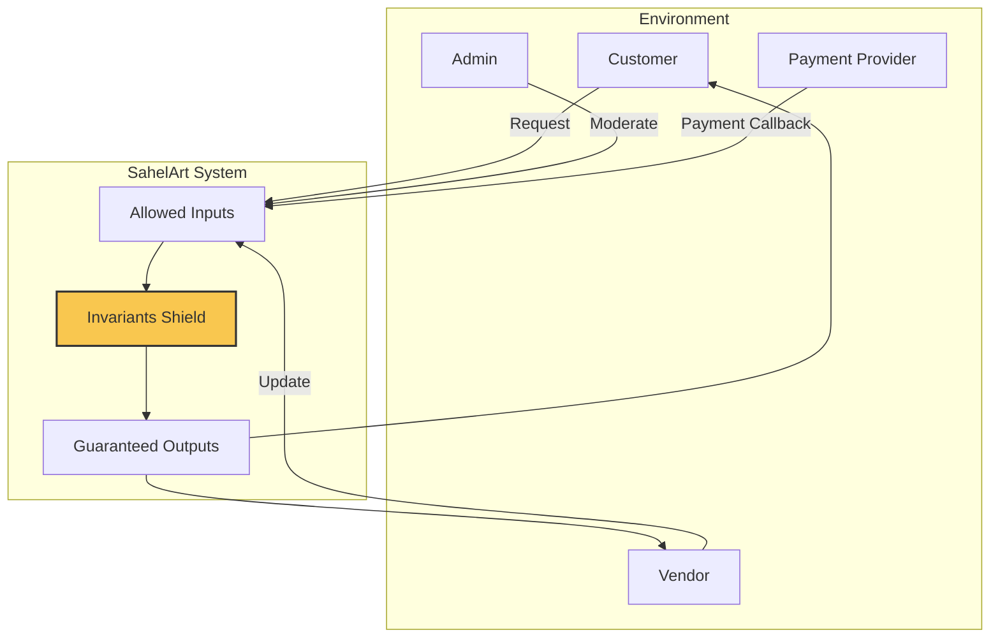
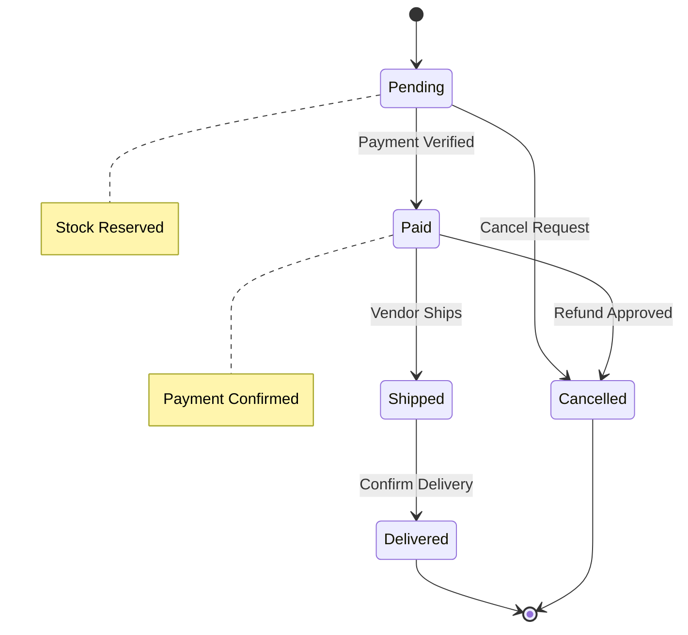

# SahelArt — System Contract & Invariants

## 1. Purpose

This document defines the formal contract between SahelArt and its environment.

It specifies:
- What the system promises
- What it guarantees
- What it forbids
- The invariants that must always hold

This document is independent of implementation.

---

## 2. Contract Overview

### 2.1 Actors (Who Interacts)

**Human Actors**
- Customer
- Vendor
- Administrator

**External Systems**
- Payment Service Provider
- Notification Service

---

### 2.2 Contract Promises (Capabilities)

The system promises the following capabilities:

1. Customers MAY browse and purchase artisan products.
2. Vendors MAY list and manage products.
3. Orders SHALL be traceable from creation to delivery.
4. Payments SHALL be verified before order confirmation.
5. Administrative actions SHALL be auditable.

---

## 3. Shielding Model (Contract Visualization)

### Interpretation

All inputs must pass through the Invariants Shield.
If any invariant is violated, the request is rejected.
The system MUST never enter an invalid state.

---

## 4. Core Invariants (System Laws)

### 4.1 Identity & Isolation

INV-1: Every User MUST have a globally unique identifier.

INV-2: A Product MUST belong to exactly one Vendor.

INV-3: A Vendor MUST NOT access another Vendor’s private data.

INV-4: A Customer MUST NOT access administrative capabilities.

---

### 4.2 Order Integrity

INV-5: An Order MUST belong to exactly one Customer.

INV-6: An Order MUST contain at least one valid Product.

INV-7: Order total MUST equal the sum of (Product price × Quantity).

INV-8: Order identifiers MUST be unique and immutable.

---

### 4.3 Stock Consistency

INV-9: Product stock MUST NEVER be negative.

INV-10: Stock reduction MUST occur atomically with Order confirmation.

---

### 4.4 Payment Integrity

INV-11: An Order MUST NOT transition to Shipped unless marked as Paid.

INV-12: Payment confirmation MUST be idempotent.

INV-13: Payment amount MUST equal Order total.

---

### 4.5 Auditability

INV-14: Administrative actions MUST be logged.

INV-15: Order state transitions MUST be traceable.

---

## 5. Forbidden States

The system MUST refuse the following situations:

FORB-1: Creating an Order with insufficient stock.

FORB-2: Modifying a Paid Order outside defined workflow.

FORB-3: Deleting a Product tied to an active Order.

FORB-4: Transitioning Order directly from Pending to Delivered.

FORB-5: Accepting unauthenticated access to protected resources.

---

## 6. Order State Machine

### State Machine Guarantees

- No transition MAY bypass required states.
- Illegal transitions MUST be rejected.
- Each transition MUST be logged.

---

## 7. Abstract Dependencies

The system depends conceptually on:

- Identity Provider (for authentication validation)
- Payment Confirmation Source
- Persistent Storage Guarantee
- Notification Channel

These are abstract obligations, not specific technologies.

---

## 8. Technical Constraints

TC-1: The system MUST support multi-vendor isolation.

TC-2: The system MUST support concurrent order placement.

TC-3: The system MUST maintain consistency under partial failure.

TC-4: The system MUST allow horizontal scalability.

---

## 9. Coherence Checklist

Actors & Interactions
- [x] All primary actors identified
- [x] External systems defined

Allowed Actions
- [x] Core capabilities listed
- [x] MVP-compatible scope defined

Guarantees & Invariants
- [x] Business invariants listed
- [x] Security isolation defined
- [x] State machine defined

Forbidden & Exceptions
- [x] Illegal transitions specified
- [x] Explicit forbidden states listed

---

## 10. Pedagogical Closure

SahelArt is now defined by:
- A contract
- A shield of invariants
- Explicit forbidden states
- A deterministic order lifecycle

This prepares the system for:
- Sequence 04: Responsibility Allocation
- Sequence 05: UML Domain Modeling

The system has Laws.
Architecture will enforce them.
Code will obey them.

