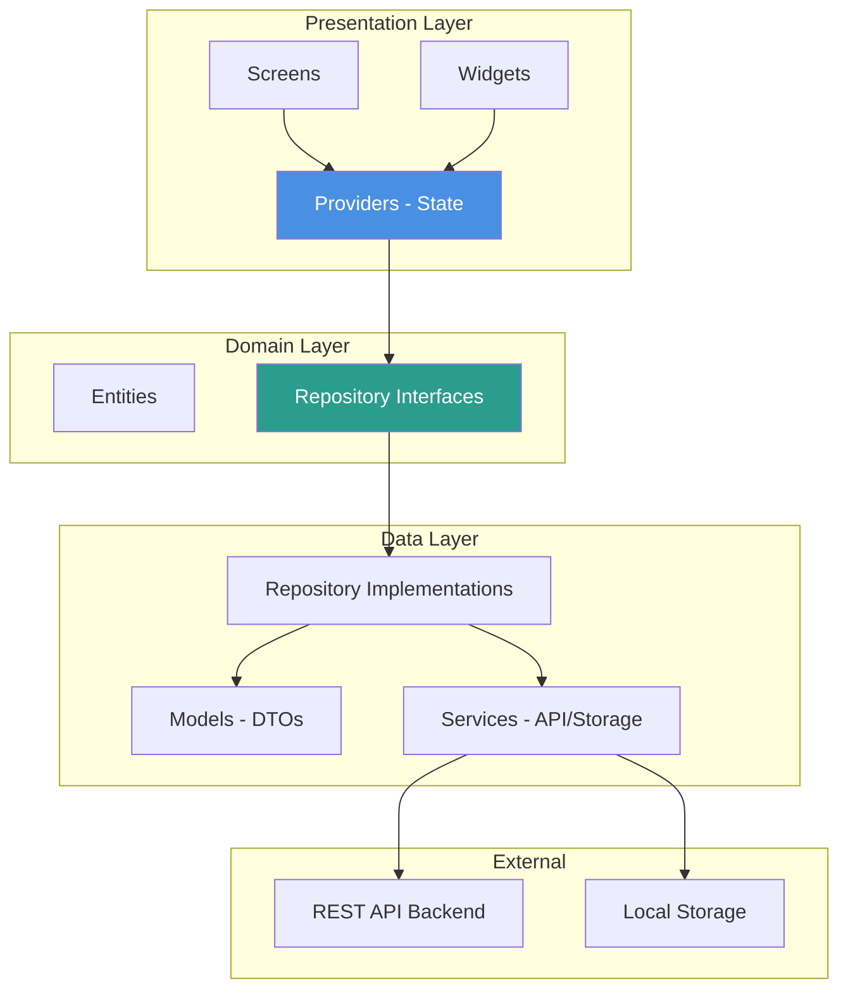
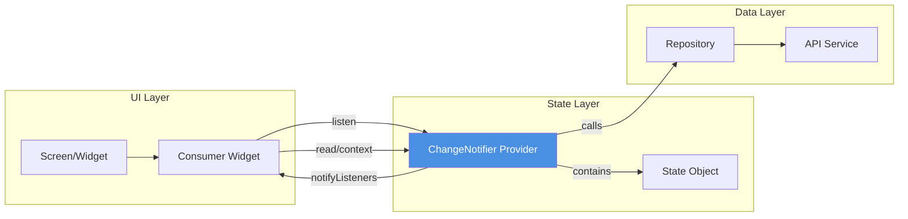

# SahelArt Frontend - Architecture Flutter

## Vue d'ensemble

Ce document définit l'architecture détaillée du frontend SahelArt, construit avec Flutter pour une expérience cross-platform (Web + Mobile).

**Version** : 1.0.0
**Date** : 2026-02-06
**Framework** : Flutter 3.27+
**State Management** : Provider 6.1+
**Platforms** : Web, Android, iOS

---

## 1. Structure du Projet

### 1.1 Organisation des dossiers

```
frontend/
├── lib/
│   ├── core/                      # Core utilities & configs
│   │   ├── constants/
│   │   │   ├── api_constants.dart
│   │   │   ├── app_constants.dart
│   │   │   └── route_constants.dart
│   │   ├── theme/
│   │   │   ├── app_theme.dart
│   │   │   ├── colors.dart
│   │   │   └── text_styles.dart
│   │   ├── routes/
│   │   │   └── app_router.dart
│   │   ├── errors/
│   │   │   └── exceptions.dart
│   │   └── utils/
│   │       ├── validators.dart
│   │       ├── formatters.dart
│   │       └── extensions.dart
│   │
│   ├── data/                      # Data layer
│   │   ├── models/                # Data models
│   │   │   ├── user_model.dart
│   │   │   ├── product_model.dart
│   │   │   ├── order_model.dart
│   │   │   ├── payment_model.dart
│   │   │   └── category_model.dart
│   │   ├── repositories/          # Repository implementations
│   │   │   ├── auth_repository.dart
│   │   │   ├── product_repository.dart
│   │   │   ├── order_repository.dart
│   │   │   └── user_repository.dart
│   │   └── services/              # API & Storage services
│   │       ├── api_service.dart
│   │       ├── auth_service.dart
│   │       ├── storage_service.dart
│   │       └── upload_service.dart
│   │
│   ├── domain/                    # Business logic
│   │   ├── entities/              # Domain entities
│   │   │   ├── user.dart
│   │   │   ├── product.dart
│   │   │   └── order.dart
│   │   └── repositories/          # Repository interfaces
│   │       ├── i_auth_repository.dart
│   │       └── i_product_repository.dart
│   │
│   ├── presentation/              # UI layer
│   │   ├── providers/             # State management (Provider)
│   │   │   ├── auth_provider.dart
│   │   │   ├── product_provider.dart
│   │   │   ├── cart_provider.dart
│   │   │   ├── order_provider.dart
│   │   │   └── theme_provider.dart
│   │   │
│   │   ├── screens/               # App screens
│   │   │   ├── auth/
│   │   │   │   ├── login_screen.dart
│   │   │   │   └── register_screen.dart
│   │   │   ├── home/
│   │   │   │   └── home_screen.dart
│   │   │   ├── products/
│   │   │   │   ├── product_list_screen.dart
│   │   │   │   ├── product_detail_screen.dart
│   │   │   │   └── vendor/
│   │   │   │       ├── create_product_screen.dart
│   │   │   │       └── manage_products_screen.dart
│   │   │   ├── cart/
│   │   │   │   └── cart_screen.dart
│   │   │   ├── orders/
│   │   │   │   ├── order_list_screen.dart
│   │   │   │   ├── order_detail_screen.dart
│   │   │   │   └── checkout_screen.dart
│   │   │   ├── profile/
│   │   │   │   └── profile_screen.dart
│   │   │   └── admin/
│   │   │       └── dashboard_screen.dart
│   │   │
│   │   └── widgets/               # Reusable widgets
│   │       ├── common/
│   │       │   ├── app_button.dart
│   │       │   ├── app_text_field.dart
│   │       │   ├── loading_indicator.dart
│   │       │   └── error_widget.dart
│   │       ├── product/
│   │       │   ├── product_card.dart
│   │       │   └── product_grid.dart
│   │       ├── order/
│   │       │   └── order_item_widget.dart
│   │       └── layouts/
│   │           ├── app_bar_widget.dart
│   │           └── bottom_nav_widget.dart
│   │
│   └── main.dart                  # App entry point
│
├── assets/                        # Static assets
│   ├── images/
│   ├── icons/
│   └── fonts/
│
├── test/                          # Tests
│   ├── unit/
│   ├── widget/
│   └── integration/
│
├── web/                           # Web-specific
├── android/                       # Android-specific
├── ios/                           # iOS-specific
│
├── pubspec.yaml
└── README.md
```

---

## 2. Architecture Pattern : Clean Architecture Simplifiée

### 2.1 Layers Overview



### 2.2 Responsabilités

**Presentation Layer** :
- UI rendering (Screens & Widgets)
- State management (Provider)
- User interaction handling
- Navigation

**Domain Layer** :
- Business entities (pure Dart classes)
- Repository contracts (interfaces)
- Business rules (optional pour MVP)

**Data Layer** :
- Data models (JSON serialization)
- Repository implementations
- API communication
- Local storage

---

## 3. State Management avec Provider

### 3.1 Architecture Provider



### 3.2 Exemple : AuthProvider

```dart
// lib/presentation/providers/auth_provider.dart
import 'package:flutter/foundation.dart';
import '../../data/models/user_model.dart';
import '../../data/repositories/auth_repository.dart';
import '../../data/services/storage_service.dart';

enum AuthStatus {
  initial,
  loading,
  authenticated,
  unauthenticated,
  error
}

class AuthProvider extends ChangeNotifier {
  final AuthRepository _authRepository;
  final StorageService _storageService;

  AuthProvider(this._authRepository, this._storageService) {
    _initAuth();
  }

  AuthStatus _status = AuthStatus.initial;
  UserModel? _user;
  String? _token;
  String? _errorMessage;

  // Getters
  AuthStatus get status => _status;
  UserModel? get user => _user;
  String? get token => _token;
  String? get errorMessage => _errorMessage;
  bool get isAuthenticated => _status == AuthStatus.authenticated;
  bool get isVendor => _user?.role == 'vendor';
  bool get isCustomer => _user?.role == 'customer';
  bool get isAdmin => _user?.role == 'admin';

  // Initialize auth from storage
  Future<void> _initAuth() async {
    final savedToken = await _storageService.getToken();

    if (savedToken != null) {
      _token = savedToken;
      try {
        _user = await _authRepository.getCurrentUser();
        _status = AuthStatus.authenticated;
      } catch (e) {
        _status = AuthStatus.unauthenticated;
        await _storageService.clearToken();
      }
    } else {
      _status = AuthStatus.unauthenticated;
    }

    notifyListeners();
  }

  // Login
  Future<void> login(String email, String password) async {
    _status = AuthStatus.loading;
    _errorMessage = null;
    notifyListeners();

    try {
      final response = await _authRepository.login(email, password);

      _token = response.token;
      _user = response.user;
      _status = AuthStatus.authenticated;

      await _storageService.saveToken(response.token);
      await _storageService.saveUser(response.user);

    } catch (e) {
      _status = AuthStatus.error;
      _errorMessage = e.toString();
    }

    notifyListeners();
  }

  // Register
  Future<void> register({
    required String email,
    required String password,
    required String firstName,
    required String lastName,
    required String role,
  }) async {
    _status = AuthStatus.loading;
    _errorMessage = null;
    notifyListeners();

    try {
      final response = await _authRepository.register(
        email: email,
        password: password,
        firstName: firstName,
        lastName: lastName,
        role: role,
      );

      _token = response.token;
      _user = response.user;
      _status = AuthStatus.authenticated;

      await _storageService.saveToken(response.token);
      await _storageService.saveUser(response.user);

    } catch (e) {
      _status = AuthStatus.error;
      _errorMessage = e.toString();
    }

    notifyListeners();
  }

  // Logout
  Future<void> logout() async {
    _status = AuthStatus.loading;
    notifyListeners();

    await _storageService.clearToken();
    await _storageService.clearUser();

    _token = null;
    _user = null;
    _status = AuthStatus.unauthenticated;

    notifyListeners();
  }
}
```

### 3.3 Exemple : ProductProvider

```dart
// lib/presentation/providers/product_provider.dart
import 'package:flutter/foundation.dart';
import '../../data/models/product_model.dart';
import '../../data/repositories/product_repository.dart';

enum ProductListStatus { initial, loading, loaded, error }

class ProductProvider extends ChangeNotifier {
  final ProductRepository _productRepository;

  ProductProvider(this._productRepository);

  // State
  ProductListStatus _status = ProductListStatus.initial;
  List<ProductModel> _products = [];
  ProductModel? _selectedProduct;
  String? _errorMessage;

  // Pagination
  int _currentPage = 1;
  final int _limit = 20;
  bool _hasMore = true;

  // Filters
  String? _categoryFilter;
  double? _minPrice;
  double? _maxPrice;
  String? _searchQuery;

  // Getters
  ProductListStatus get status => _status;
  List<ProductModel> get products => _products;
  ProductModel? get selectedProduct => _selectedProduct;
  String? get errorMessage => _errorMessage;
  bool get hasMore => _hasMore;
  bool get isLoading => _status == ProductListStatus.loading;

  // Fetch products with pagination
  Future<void> fetchProducts({bool refresh = false}) async {
    if (refresh) {
      _currentPage = 1;
      _products = [];
      _hasMore = true;
    }

    if (!_hasMore || isLoading) return;

    _status = ProductListStatus.loading;
    _errorMessage = null;
    notifyListeners();

    try {
      final response = await _productRepository.getProducts(
        page: _currentPage,
        limit: _limit,
        category: _categoryFilter,
        minPrice: _minPrice,
        maxPrice: _maxPrice,
        search: _searchQuery,
      );

      if (refresh) {
        _products = response.data;
      } else {
        _products.addAll(response.data);
      }

      _hasMore = response.pagination.hasNext;
      _currentPage++;
      _status = ProductListStatus.loaded;

    } catch (e) {
      _status = ProductListStatus.error;
      _errorMessage = e.toString();
    }

    notifyListeners();
  }

  // Fetch product by ID
  Future<void> fetchProductById(String id) async {
    _status = ProductListStatus.loading;
    notifyListeners();

    try {
      _selectedProduct = await _productRepository.getProductById(id);
      _status = ProductListStatus.loaded;
    } catch (e) {
      _status = ProductListStatus.error;
      _errorMessage = e.toString();
    }

    notifyListeners();
  }

  // Create product (vendor only)
  Future<ProductModel?> createProduct(ProductModel product) async {
    _status = ProductListStatus.loading;
    notifyListeners();

    try {
      final created = await _productRepository.createProduct(product);
      _products.insert(0, created); // Add to top
      _status = ProductListStatus.loaded;
      notifyListeners();
      return created;
    } catch (e) {
      _status = ProductListStatus.error;
      _errorMessage = e.toString();
      notifyListeners();
      return null;
    }
  }

  // Update product
  Future<bool> updateProduct(String id, ProductModel product) async {
    try {
      final updated = await _productRepository.updateProduct(id, product);

      final index = _products.indexWhere((p) => p.id == id);
      if (index != -1) {
        _products[index] = updated;
      }

      if (_selectedProduct?.id == id) {
        _selectedProduct = updated;
      }

      notifyListeners();
      return true;
    } catch (e) {
      _errorMessage = e.toString();
      notifyListeners();
      return false;
    }
  }

  // Delete product
  Future<bool> deleteProduct(String id) async {
    try {
      await _productRepository.deleteProduct(id);
      _products.removeWhere((p) => p.id == id);
      notifyListeners();
      return true;
    } catch (e) {
      _errorMessage = e.toString();
      notifyListeners();
      return false;
    }
  }

  // Apply filters
  void applyFilters({
    String? category,
    double? minPrice,
    double? maxPrice,
    String? search,
  }) {
    _categoryFilter = category;
    _minPrice = minPrice;
    _maxPrice = maxPrice;
    _searchQuery = search;

    fetchProducts(refresh: true);
  }

  // Clear filters
  void clearFilters() {
    _categoryFilter = null;
    _minPrice = null;
    _maxPrice = null;
    _searchQuery = null;

    fetchProducts(refresh: true);
  }
}
```

### 3.4 Exemple : CartProvider

```dart
// lib/presentation/providers/cart_provider.dart
import 'package:flutter/foundation.dart';
import '../../data/models/product_model.dart';

class CartItem {
  final ProductModel product;
  int quantity;

  CartItem({required this.product, this.quantity = 1});

  double get subtotal => product.price * quantity;
}

class CartProvider extends ChangeNotifier {
  final Map<String, CartItem> _items = {};

  // Getters
  Map<String, CartItem> get items => {..._items};
  int get itemCount => _items.length;
  int get totalQuantity => _items.values.fold(0, (sum, item) => sum + item.quantity);

  double get total => _items.values.fold(
    0.0,
    (sum, item) => sum + item.subtotal,
  );

  bool get isEmpty => _items.isEmpty;

  // Add to cart
  void addItem(ProductModel product, {int quantity = 1}) {
    if (_items.containsKey(product.id)) {
      // Increase quantity
      _items[product.id]!.quantity += quantity;
    } else {
      // Add new item
      _items[product.id] = CartItem(product: product, quantity: quantity);
    }

    notifyListeners();
  }

  // Remove from cart
  void removeItem(String productId) {
    _items.remove(productId);
    notifyListeners();
  }

  // Update quantity
  void updateQuantity(String productId, int quantity) {
    if (!_items.containsKey(productId)) return;

    if (quantity <= 0) {
      removeItem(productId);
    } else {
      _items[productId]!.quantity = quantity;
      notifyListeners();
    }
  }

  // Increase quantity
  void increaseQuantity(String productId) {
    if (_items.containsKey(productId)) {
      _items[productId]!.quantity++;
      notifyListeners();
    }
  }

  // Decrease quantity
  void decreaseQuantity(String productId) {
    if (!_items.containsKey(productId)) return;

    if (_items[productId]!.quantity > 1) {
      _items[productId]!.quantity--;
    } else {
      removeItem(productId);
    }

    notifyListeners();
  }

  // Clear cart
  void clear() {
    _items.clear();
    notifyListeners();
  }
}
```

---

## 4. Data Layer

### 4.1 Models (JSON Serialization)

```dart
// lib/data/models/product_model.dart
import 'package:json_annotation/json_annotation.dart';

part 'product_model.g.dart';

@JsonSerializable()
class ProductModel {
  @JsonKey(name: '_id')
  final String id;

  final String vendorId;
  final String categoryId;
  final String name;
  final String description;
  final double price;
  final int stock;
  final List<String> images;
  final String status;
  final DateTime createdAt;
  final DateTime updatedAt;

  ProductModel({
    required this.id,
    required this.vendorId,
    required this.categoryId,
    required this.name,
    required this.description,
    required this.price,
    required this.stock,
    required this.images,
    required this.status,
    required this.createdAt,
    required this.updatedAt,
  });

  factory ProductModel.fromJson(Map<String, dynamic> json) =>
      _$ProductModelFromJson(json);

  Map<String, dynamic> toJson() => _$ProductModelToJson(this);

  // Helper getters
  String get mainImage => images.isNotEmpty ? images.first : '';
  bool get isAvailable => status == 'active' && stock > 0;
}
```

```dart
// lib/data/models/order_model.dart
import 'package:json_annotation/json_annotation.dart';

part 'order_model.g.dart';

@JsonSerializable()
class OrderItemModel {
  final String productId;
  final String vendorId;
  final String name;
  final double price;
  final int quantity;
  final double subtotal;

  OrderItemModel({
    required this.productId,
    required this.vendorId,
    required this.name,
    required this.price,
    required this.quantity,
    required this.subtotal,
  });

  factory OrderItemModel.fromJson(Map<String, dynamic> json) =>
      _$OrderItemModelFromJson(json);

  Map<String, dynamic> toJson() => _$OrderItemModelToJson(this);
}

@JsonSerializable()
class ShippingAddressModel {
  final String street;
  final String city;
  final String? postalCode;
  final String country;
  final String phone;

  ShippingAddressModel({
    required this.street,
    required this.city,
    this.postalCode,
    required this.country,
    required this.phone,
  });

  factory ShippingAddressModel.fromJson(Map<String, dynamic> json) =>
      _$ShippingAddressModelFromJson(json);

  Map<String, dynamic> toJson() => _$ShippingAddressModelToJson(this);
}

@JsonSerializable()
class OrderModel {
  @JsonKey(name: '_id')
  final String id;

  final String customerId;
  final List<OrderItemModel> items;
  final double total;
  final String status;
  final ShippingAddressModel shippingAddress;
  final DateTime createdAt;
  final DateTime updatedAt;

  OrderModel({
    required this.id,
    required this.customerId,
    required this.items,
    required this.total,
    required this.status,
    required this.shippingAddress,
    required this.createdAt,
    required this.updatedAt,
  });

  factory OrderModel.fromJson(Map<String, dynamic> json) =>
      _$OrderModelFromJson(json);

  Map<String, dynamic> toJson() => _$OrderModelToJson(this);

  // Helper getters
  bool get isPending => status == 'Pending';
  bool get isPaid => status == 'Paid';
  bool get isShipped => status == 'Shipped';
  bool get isDelivered => status == 'Delivered';
  bool get isCancelled => status == 'Cancelled';
}
```

### 4.2 API Service

```dart
// lib/data/services/api_service.dart
import 'package:dio/dio.dart';
import '../../core/constants/api_constants.dart';
import 'storage_service.dart';

class ApiService {
  late final Dio _dio;
  final StorageService _storageService;

  ApiService(this._storageService) {
    _dio = Dio(
      BaseOptions(
        baseUrl: ApiConstants.baseUrl,
        connectTimeout: const Duration(seconds: 30),
        receiveTimeout: const Duration(seconds: 30),
        headers: {
          'Content-Type': 'application/json',
          'Accept': 'application/json',
        },
      ),
    );

    _setupInterceptors();
  }

  void _setupInterceptors() {
    _dio.interceptors.add(
      InterceptorsWrapper(
        onRequest: (options, handler) async {
          // Add auth token
          final token = await _storageService.getToken();
          if (token != null) {
            options.headers['Authorization'] = 'Bearer $token';
          }

          return handler.next(options);
        },
        onResponse: (response, handler) {
          return handler.next(response);
        },
        onError: (error, handler) async {
          // Handle 401 Unauthorized
          if (error.response?.statusCode == 401) {
            await _storageService.clearToken();
            // Navigate to login (via event bus or callback)
          }

          return handler.next(error);
        },
      ),
    );

    // Logging interceptor (dev only)
    if (const bool.fromEnvironment('dart.vm.product') == false) {
      _dio.interceptors.add(LogInterceptor(
        requestBody: true,
        responseBody: true,
      ));
    }
  }

  // GET request
  Future<Response> get(
    String path, {
    Map<String, dynamic>? queryParameters,
  }) async {
    try {
      return await _dio.get(path, queryParameters: queryParameters);
    } on DioException catch (e) {
      throw _handleError(e);
    }
  }

  // POST request
  Future<Response> post(
    String path, {
    dynamic data,
    Map<String, dynamic>? queryParameters,
  }) async {
    try {
      return await _dio.post(
        path,
        data: data,
        queryParameters: queryParameters,
      );
    } on DioException catch (e) {
      throw _handleError(e);
    }
  }

  // PATCH request
  Future<Response> patch(
    String path, {
    dynamic data,
  }) async {
    try {
      return await _dio.patch(path, data: data);
    } on DioException catch (e) {
      throw _handleError(e);
    }
  }

  // DELETE request
  Future<Response> delete(String path) async {
    try {
      return await _dio.delete(path);
    } on DioException catch (e) {
      throw _handleError(e);
    }
  }

  // Upload file
  Future<Response> uploadFile(
    String path,
    String filePath, {
    Map<String, dynamic>? data,
  }) async {
    try {
      final formData = FormData.fromMap({
        ...?data,
        'file': await MultipartFile.fromFile(filePath),
      });

      return await _dio.post(path, data: formData);
    } on DioException catch (e) {
      throw _handleError(e);
    }
  }

  // Error handling
  Exception _handleError(DioException error) {
    switch (error.type) {
      case DioExceptionType.connectionTimeout:
      case DioExceptionType.sendTimeout:
      case DioExceptionType.receiveTimeout:
        return Exception('Connection timeout. Please check your internet.');

      case DioExceptionType.badResponse:
        final statusCode = error.response?.statusCode;
        final message = error.response?.data['error']?['message'] ??
            'Something went wrong';

        switch (statusCode) {
          case 400:
            return Exception('Bad request: $message');
          case 401:
            return Exception('Unauthorized. Please login again.');
          case 403:
            return Exception('Forbidden: $message');
          case 404:
            return Exception('Not found: $message');
          case 409:
            return Exception('Conflict: $message');
          case 500:
            return Exception('Server error. Please try again later.');
          default:
            return Exception(message);
        }

      case DioExceptionType.cancel:
        return Exception('Request cancelled');

      default:
        return Exception('Network error. Please check your connection.');
    }
  }
}
```

### 4.3 Repository Implementation

```dart
// lib/data/repositories/product_repository.dart
import '../models/product_model.dart';
import '../services/api_service.dart';
import '../../core/constants/api_constants.dart';

class PaginatedResponse<T> {
  final List<T> data;
  final PaginationInfo pagination;

  PaginatedResponse({required this.data, required this.pagination});
}

class PaginationInfo {
  final int page;
  final int limit;
  final int total;
  final int pages;
  final bool hasNext;
  final bool hasPrev;

  PaginationInfo({
    required this.page,
    required this.limit,
    required this.total,
    required this.pages,
    required this.hasNext,
    required this.hasPrev,
  });

  factory PaginationInfo.fromJson(Map<String, dynamic> json) {
    return PaginationInfo(
      page: json['page'],
      limit: json['limit'],
      total: json['total'],
      pages: json['pages'],
      hasNext: json['hasNext'],
      hasPrev: json['hasPrev'],
    );
  }
}

class ProductRepository {
  final ApiService _apiService;

  ProductRepository(this._apiService);

  // Get products with pagination and filters
  Future<PaginatedResponse<ProductModel>> getProducts({
    int page = 1,
    int limit = 20,
    String? category,
    double? minPrice,
    double? maxPrice,
    String? search,
  }) async {
    final queryParams = {
      'page': page.toString(),
      'limit': limit.toString(),
      if (category != null) 'category': category,
      if (minPrice != null) 'minPrice': minPrice.toString(),
      if (maxPrice != null) 'maxPrice': maxPrice.toString(),
      if (search != null) 'search': search,
    };

    final response = await _apiService.get(
      ApiConstants.products,
      queryParameters: queryParams,
    );

    final data = (response.data['data'] as List)
        .map((json) => ProductModel.fromJson(json))
        .toList();

    final pagination = PaginationInfo.fromJson(response.data['pagination']);

    return PaginatedResponse(data: data, pagination: pagination);
  }

  // Get product by ID
  Future<ProductModel> getProductById(String id) async {
    final response = await _apiService.get('${ApiConstants.products}/$id');
    return ProductModel.fromJson(response.data['data']);
  }

  // Create product (vendor only)
  Future<ProductModel> createProduct(ProductModel product) async {
    final response = await _apiService.post(
      ApiConstants.products,
      data: product.toJson(),
    );
    return ProductModel.fromJson(response.data['data']);
  }

  // Update product
  Future<ProductModel> updateProduct(String id, ProductModel product) async {
    final response = await _apiService.patch(
      '${ApiConstants.products}/$id',
      data: product.toJson(),
    );
    return ProductModel.fromJson(response.data['data']);
  }

  // Delete product
  Future<void> deleteProduct(String id) async {
    await _apiService.delete('${ApiConstants.products}/$id');
  }

  // Upload product images
  Future<List<String>> uploadImages(String productId, List<String> filePaths) async {
    final List<String> uploadedUrls = [];

    for (final filePath in filePaths) {
      final response = await _apiService.uploadFile(
        '${ApiConstants.products}/$productId/images',
        filePath,
      );

      uploadedUrls.add(response.data['data']['url']);
    }

    return uploadedUrls;
  }
}
```

---

## 5. Navigation & Routing

### 5.1 Route Configuration

```dart
// lib/core/routes/app_router.dart
import 'package:go_router/go_router.dart';
import 'package:flutter/material.dart';
import '../../presentation/screens/auth/login_screen.dart';
import '../../presentation/screens/auth/register_screen.dart';
import '../../presentation/screens/home/home_screen.dart';
import '../../presentation/screens/products/product_detail_screen.dart';
import '../../presentation/providers/auth_provider.dart';

class AppRouter {
  final AuthProvider authProvider;

  AppRouter(this.authProvider);

  late final GoRouter router = GoRouter(
    initialLocation: '/',
    redirect: (context, state) {
      final isAuthenticated = authProvider.isAuthenticated;
      final isAuthRoute = state.location.startsWith('/auth');

      // Redirect to login if not authenticated
      if (!isAuthenticated && !isAuthRoute) {
        return '/auth/login';
      }

      // Redirect to home if authenticated and on auth route
      if (isAuthenticated && isAuthRoute) {
        return '/';
      }

      return null;
    },
    routes: [
      GoRoute(
        path: '/',
        builder: (context, state) => const HomeScreen(),
      ),
      GoRoute(
        path: '/auth/login',
        builder: (context, state) => const LoginScreen(),
      ),
      GoRoute(
        path: '/auth/register',
        builder: (context, state) => const RegisterScreen(),
      ),
      GoRoute(
        path: '/products/:id',
        builder: (context, state) {
          final id = state.pathParameters['id']!;
          return ProductDetailScreen(productId: id);
        },
      ),
      GoRoute(
        path: '/cart',
        builder: (context, state) => const CartScreen(),
      ),
      GoRoute(
        path: '/orders',
        builder: (context, state) => const OrderListScreen(),
      ),
      GoRoute(
        path: '/profile',
        builder: (context, state) => const ProfileScreen(),
      ),
      // Vendor routes
      GoRoute(
        path: '/vendor/products/create',
        builder: (context, state) => const CreateProductScreen(),
      ),
      GoRoute(
        path: '/vendor/products',
        builder: (context, state) => const ManageProductsScreen(),
      ),
    ],
    errorBuilder: (context, state) => const NotFoundScreen(),
  );
}
```

---

## 6. UI Components & Widgets

### 6.1 Product Card Widget

```dart
// lib/presentation/widgets/product/product_card.dart
import 'package:flutter/material.dart';
import 'package:cached_network_image/cached_network_image.dart';
import '../../../data/models/product_model.dart';
import '../../../core/theme/colors.dart';

class ProductCard extends StatelessWidget {
  final ProductModel product;
  final VoidCallback onTap;

  const ProductCard({
    Key? key,
    required this.product,
    required this.onTap,
  }) : super(key: key);

  @override
  Widget build(BuildContext context) {
    return GestureDetector(
      onTap: onTap,
      child: Card(
        elevation: 2,
        shape: RoundedRectangleBorder(
          borderRadius: BorderRadius.circular(12),
        ),
        child: Column(
          crossAxisAlignment: CrossAxisAlignment.start,
          children: [
            // Image
            Expanded(
              child: ClipRRect(
                borderRadius: const BorderRadius.vertical(
                  top: Radius.circular(12),
                ),
                child: CachedNetworkImage(
                  imageUrl: product.mainImage,
                  fit: BoxFit.cover,
                  width: double.infinity,
                  placeholder: (context, url) => Container(
                    color: Colors.grey[200],
                    child: const Center(
                      child: CircularProgressIndicator(),
                    ),
                  ),
                  errorWidget: (context, url, error) => Container(
                    color: Colors.grey[200],
                    child: const Icon(Icons.error),
                  ),
                ),
              ),
            ),

            // Info
            Padding(
              padding: const EdgeInsets.all(12),
              child: Column(
                crossAxisAlignment: CrossAxisAlignment.start,
                children: [
                  Text(
                    product.name,
                    style: const TextStyle(
                      fontSize: 16,
                      fontWeight: FontWeight.w600,
                    ),
                    maxLines: 2,
                    overflow: TextOverflow.ellipsis,
                  ),
                  const SizedBox(height: 4),
                  Text(
                    '${product.price.toStringAsFixed(0)} FCFA',
                    style: TextStyle(
                      fontSize: 18,
                      fontWeight: FontWeight.bold,
                      color: AppColors.primary,
                    ),
                  ),
                  const SizedBox(height: 4),
                  Row(
                    children: [
                      Icon(
                        Icons.inventory_2_outlined,
                        size: 16,
                        color: product.stock > 0
                            ? Colors.green
                            : Colors.red,
                      ),
                      const SizedBox(width: 4),
                      Text(
                        product.stock > 0
                            ? '${product.stock} en stock'
                            : 'Rupture de stock',
                        style: TextStyle(
                          fontSize: 12,
                          color: product.stock > 0
                              ? Colors.green
                              : Colors.red,
                        ),
                      ),
                    ],
                  ),
                ],
              ),
            ),
          ],
        ),
      ),
    );
  }
}
```

### 6.2 Responsive Layout Helper

```dart
// lib/core/utils/responsive.dart
import 'package:flutter/material.dart';

class Responsive {
  static bool isMobile(BuildContext context) =>
      MediaQuery.of(context).size.width < 650;

  static bool isTablet(BuildContext context) =>
      MediaQuery.of(context).size.width >= 650 &&
      MediaQuery.of(context).size.width < 1100;

  static bool isDesktop(BuildContext context) =>
      MediaQuery.of(context).size.width >= 1100;

  static T responsive<T>({
    required BuildContext context,
    required T mobile,
    T? tablet,
    T? desktop,
  }) {
    if (isDesktop(context) && desktop != null) return desktop;
    if (isTablet(context) && tablet != null) return tablet;
    return mobile;
  }

  static int gridCrossAxisCount(BuildContext context) {
    if (isDesktop(context)) return 4;
    if (isTablet(context)) return 3;
    return 2;
  }
}
```

---

## 7. Platform-Specific Considerations

### 7.1 Web vs Mobile Differences

```dart
// lib/core/utils/platform_utils.dart
import 'package:flutter/foundation.dart';

class PlatformUtils {
  static bool get isWeb => kIsWeb;
  static bool get isMobile => !kIsWeb;

  static double getMaxWidth(BuildContext context) {
    if (isWeb) {
      return 1200; // Max width for web
    }
    return MediaQuery.of(context).size.width;
  }

  static EdgeInsets getHorizontalPadding(BuildContext context) {
    if (isWeb) {
      final width = MediaQuery.of(context).size.width;
      final padding = (width - 1200).clamp(0, double.infinity) / 2;
      return EdgeInsets.symmetric(horizontal: padding + 16);
    }
    return const EdgeInsets.symmetric(horizontal: 16);
  }
}
```

### 7.2 Storage Service (Web vs Mobile)

```dart
// lib/data/services/storage_service.dart
import 'package:flutter_secure_storage/flutter_secure_storage.dart';
import 'package:shared_preferences/shared_preferences.dart';
import 'package:flutter/foundation.dart';

class StorageService {
  late final FlutterSecureStorage _secureStorage;
  late final SharedPreferences _prefs;

  Future<void> init() async {
    if (!kIsWeb) {
      _secureStorage = const FlutterSecureStorage();
    }
    _prefs = await SharedPreferences.getInstance();
  }

  // Token storage (secure on mobile, prefs on web)
  Future<void> saveToken(String token) async {
    if (kIsWeb) {
      await _prefs.setString('auth_token', token);
    } else {
      await _secureStorage.write(key: 'auth_token', value: token);
    }
  }

  Future<String?> getToken() async {
    if (kIsWeb) {
      return _prefs.getString('auth_token');
    } else {
      return await _secureStorage.read(key: 'auth_token');
    }
  }

  Future<void> clearToken() async {
    if (kIsWeb) {
      await _prefs.remove('auth_token');
    } else {
      await _secureStorage.delete(key: 'auth_token');
    }
  }

  // User data (JSON serialized)
  Future<void> saveUser(dynamic user) async {
    await _prefs.setString('user_data', jsonEncode(user));
  }

  Future<Map<String, dynamic>?> getUser() async {
    final data = _prefs.getString('user_data');
    if (data != null) {
      return jsonDecode(data);
    }
    return null;
  }

  Future<void> clearUser() async {
    await _prefs.remove('user_data');
  }
}
```

---

## 8. Performance Optimizations

### 8.1 Image Caching

```yaml
# pubspec.yaml
dependencies:
  cached_network_image: ^3.3.0
```

```dart
// Usage
CachedNetworkImage(
  imageUrl: product.imageUrl,
  memCacheWidth: 400,
  memCacheHeight: 400,
  placeholder: (context, url) => const CircularProgressIndicator(),
  errorWidget: (context, url, error) => const Icon(Icons.error),
)
```

### 8.2 Lazy Loading Lists

```dart
// Infinite scroll with pagination
class ProductListScreen extends StatefulWidget {
  @override
  State<ProductListScreen> createState() => _ProductListScreenState();
}

class _ProductListScreenState extends State<ProductListScreen> {
  final ScrollController _scrollController = ScrollController();

  @override
  void initState() {
    super.initState();
    _scrollController.addListener(_onScroll);
  }

  void _onScroll() {
    if (_scrollController.position.pixels >=
        _scrollController.position.maxScrollExtent * 0.9) {
      // Load more when 90% scrolled
      context.read<ProductProvider>().fetchProducts();
    }
  }

  @override
  Widget build(BuildContext context) {
    return Consumer<ProductProvider>(
      builder: (context, provider, child) {
        return GridView.builder(
          controller: _scrollController,
          itemCount: provider.products.length + (provider.hasMore ? 1 : 0),
          gridDelegate: SliverGridDelegateWithFixedCrossAxisCount(
            crossAxisCount: Responsive.gridCrossAxisCount(context),
            childAspectRatio: 0.7,
          ),
          itemBuilder: (context, index) {
            if (index == provider.products.length) {
              return const Center(child: CircularProgressIndicator());
            }
            return ProductCard(product: provider.products[index]);
          },
        );
      },
    );
  }
}
```

---

## 9. Testing

### 9.1 Unit Tests

```dart
// test/unit/providers/cart_provider_test.dart
import 'package:flutter_test/flutter_test.dart';
import 'package:sahelart/presentation/providers/cart_provider.dart';
import 'package:sahelart/data/models/product_model.dart';

void main() {
  group('CartProvider', () {
    late CartProvider cartProvider;

    setUp(() {
      cartProvider = CartProvider();
    });

    test('should add item to cart', () {
      final product = ProductModel(
        id: '1',
        name: 'Test Product',
        price: 1000,
        stock: 10,
        // ... other fields
      );

      cartProvider.addItem(product);

      expect(cartProvider.itemCount, 1);
      expect(cartProvider.total, 1000);
    });

    test('should increase quantity when adding same item', () {
      final product = ProductModel(id: '1', price: 1000, /* ... */);

      cartProvider.addItem(product, quantity: 2);
      cartProvider.addItem(product, quantity: 1);

      expect(cartProvider.itemCount, 1);
      expect(cartProvider.totalQuantity, 3);
      expect(cartProvider.total, 3000);
    });

    test('should remove item from cart', () {
      final product = ProductModel(id: '1', price: 1000, /* ... */);

      cartProvider.addItem(product);
      cartProvider.removeItem('1');

      expect(cartProvider.isEmpty, true);
      expect(cartProvider.total, 0);
    });
  });
}
```

---

## 10. Deployment

### 10.1 Web Build

```bash
flutter build web --release --base-href "/"

# Output: build/web/
```

### 10.2 Mobile Build

```bash
# Android
flutter build apk --release
flutter build appbundle --release

# iOS
flutter build ios --release
```

### 10.3 Environment Configuration

```dart
// lib/core/constants/api_constants.dart
class ApiConstants {
  static const String baseUrl = String.fromEnvironment(
    'API_BASE_URL',
    defaultValue: 'http://localhost:3000/api',
  );

  static const String uploads = '$baseUrl/uploads';

  static const String auth = '/auth';
  static const String products = '/products';
  static const String orders = '/orders';
  static const String payments = '/payments';
}
```

```bash
# Build with custom API URL
flutter build web --dart-define=API_BASE_URL=https://api.sahelart.bf/api
```

---

## 11. Conclusion

Cette architecture frontend Flutter est conçue pour :

1. **Cross-platform** : Single codebase pour Web + Mobile
2. **State management simple** : Provider, facile à comprendre et maintenir
3. **Separation of concerns** : Presentation / Domain / Data layers
4. **Performance** : Lazy loading, caching, pagination
5. **Responsive** : Adapte UI selon device (mobile/tablet/desktop)
6. **Type-safe** : Models avec JSON serialization
7. **Testable** : Architecture permet unit/widget/integration tests

**Principe directeur** :
> "Simple state, clear layers, responsive UI, great UX."

---

**Document Version** : 1.0.0
**Dernière mise à jour** : 2026-02-06
